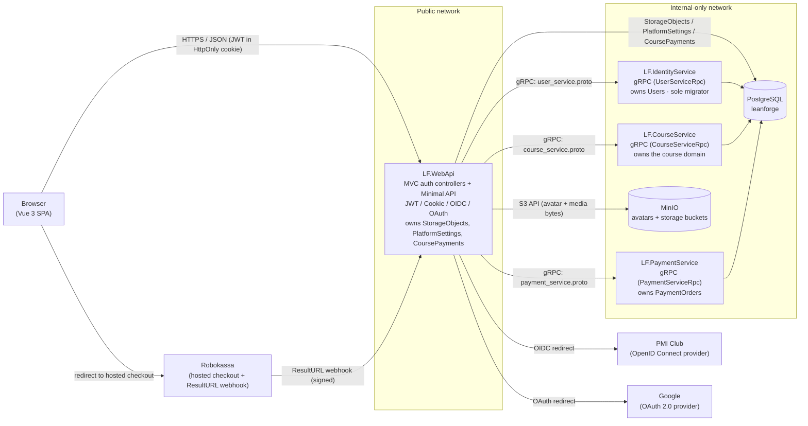
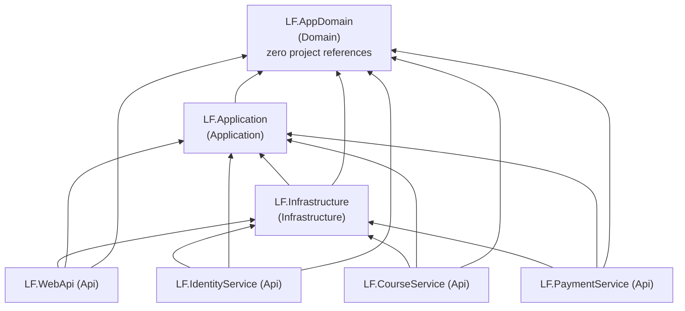

# Lean Forge LMS — Architecture

This document describes how Lean Forge LMS is built. For what the project is and how to
get it running quickly, see [`README.md`](./README.md). For contributor conventions and
anti-patterns, see [`CLAUDE.md`](./CLAUDE.md).

## Overview

Lean Forge LMS runs as **four independently deployable ASP.NET Core processes** plus a Vue 3
single-page app, backed by one PostgreSQL database and one MinIO object store:

- **`LF.WebApi`** — the only public-facing process. Hosts the SPA, the authentication
  pipeline (MVC controllers), and the Minimal API surface. Acts as a BFF / gateway.
- **`LF.IdentityService`**, **`LF.CourseService`**, **`LF.PaymentService`** — internal
  gRPC-only services, each the single owner of one slice of the domain.

Stack: **.NET 10 / C# 14**, EF Core + Npgsql, gRPC for inter-service calls, MinIO for
blobs, Robokassa for payments. **.NET Aspire** orchestrates everything for local
development; **Docker Compose** is the production deployment.

Within every service, code follows **Clean Architecture** with dependencies pointing
strictly inward (`Domain ← Application ← Infrastructure ← Api`).

## Service topology

- **`LF.WebApi`** — hosts the Vue SPA, the JWT/Cookie/OIDC/OAuth authentication pipeline
  (MVC controllers), and the growing Minimal API surface (`IEndpointGroup`s, auto-discovered).
  It reaches the three internal services only through their gRPC contracts. In Postgres it
  touches only three ownerless / orchestration tables directly: `StorageObjects`,
  `PlatformSettings`, `CoursePayments` (see [Data & persistence](#data--persistence)).
- **`LF.IdentityService`** — internal gRPC service that owns all user identity data
  (`Users`). It is also the **sole schema owner/migrator** for the shared database.
- **`LF.CourseService`** — internal gRPC service that owns the course domain: courses,
  categories, chapters, lessons (text / media / quiz / files parts), enrollments,
  quiz attempts, and promo codes.
- **`LF.PaymentService`** — internal gRPC service that owns payment orders (`LFPaymentOrders`)
  and the Robokassa integration (signed checkout-URL construction, ResultURL/SuccessURL
  signature verification). It knows nothing about courses or enrollments — `LF.WebApi`
  orchestrates the two after a payment settles.
- **PostgreSQL** (`leanforge`) — one database, shared by all four hosts; each host only
  ever touches the tables it owns.
- **MinIO** — S3-compatible object storage, reachable only from `LF.WebApi`, never from the
  browser. Two buckets: `avatars` (user avatars) and `storage` (course cover images and
  lesson media — image / video / audio / file blocks).



**Why the split exists.** Each internal service is the single owner of its slice of the
domain, and `LF.WebApi` reaches them exclusively through their gRPC contracts
(`user_service.proto`, `course_service.proto`, `payment_service.proto`). Course / chapter /
lesson / enrollment mutations always go through `LF.CourseService` because they carry real
business rules (ownership checks, publish invariants, quiz grading) that must not be
duplicated across processes. Payment settlement flows the same way: Robokassa's ResultURL
webhook lands on `LF.WebApi`, which calls `LF.PaymentService` (verify signature, settle the
order) and then `LF.CourseService` (`ConfirmEnrollmentPayment` — activate the enrollment,
redeem the promo code); both calls are idempotent, so a webhook retry is safe.

**The direct-DB exceptions.** Three tables are reached from `LF.WebApi` via `IAppDbContext`
rather than a gRPC round-trip, each for a deliberate reason:

- **`StorageObjects`** (avatar / cover-image / lesson-media metadata) is a generic, ownerless
  table, and `LF.WebApi` is the only process with both a MinIO client and a reason to write
  it — so `IStorageService.UploadMediaAsync` does the MinIO upload and the metadata write in
  one call instead of two hops. `LF.CourseService` only ever *reads* `StorageObjects`.
- **`PlatformSettings`** (the runtime enrollment kill-switch) and **`CoursePayments`** (the
  marketing payments ledger) are orchestration state: `LF.WebApi` is the coordinator that
  already has every join it needs (`Users`, `Courses`, `Enrollments`, `PromoCodes`,
  `PaymentOrders`) in a single `IAppDbContext`, so the ledger projection and the settings
  read/write live there. `PlatformSettings` is also read by `LF.CourseService` (to enforce
  the switch inside `EnrollmentService`).

Ownership is enforced by convention (which host's `Program.cs` / DI wires up which use-case
services), not by database-level permissions.

## Clean Architecture layers



| Layer | Project | Responsibility |
|---|---|---|
| Domain | `LF.AppDomain` | Entities with behavior (`DbUser`, `Course`, `Chapter`, `Lesson`, `LessonPart`, `LessonPartFile`, `Category`, `Enrollment`, `QuizQuestion`, `QuizOption`, `QuizAttempt`, `PromoCode`, `PaymentOrder`, `CoursePayment`, `PlatformSettings`, `StorageObject`), enums (`UserRole`, `CoursePricingType`, `CourseEnrollmentMode`, `EnrollmentStatus`, `LessonPartType`, `QuestionType`, `PromoCodeDiscountType`, `PaymentOrderStatus`, `CourseCoverType`, `CourseCoverColor`, `StorageObjectType`). Zero project or framework references by design. |
| Application | `LF.Application` | Use-case services, DTOs, Mapster mapping configs, and the abstractions Infrastructure implements (`IAppDbContext`, `IFileStorageService`, `IPaymentGateway`, `IHtmlSanitizer`, `IGrpcIdentityService`, `IGrpcCourseService`, `IGrpcEnrollmentService`, `IGrpcPromoCodeService`, `IGrpcPaymentService`, `IStorageRepository`). No mediator/dispatcher library — endpoints call these services directly. |
| Infrastructure | `LF.Infrastructure` | EF Core (`AppDbContext`, Npgsql, one `IEntityTypeConfiguration` per entity), the gRPC clients to the three internal services, the MinIO-backed `IFileStorageService` (two keyed buckets), the Robokassa-backed `IPaymentGateway`, the Ganss-backed `IHtmlSanitizer`, `StorageRepository` (the one deliberate repository), and `DatabaseInitializer` (migrations + seeding + backfill). Split into narrow DI extensions so each host wires only what it needs. |
| Api | `LF.WebApi`, `LF.IdentityService`, `LF.CourseService`, `LF.PaymentService` | Host projects. `LF.WebApi` is ASP.NET Core MVC (auth controllers) + Minimal API (`IEndpointGroup`, auto-discovered) — the only public-facing process. The other three are bare gRPC hosts, internal-only. |

**Use-case services, per host.** `LF.Application`'s DI is split by host, not one
`AddApplication()` — ASP.NET Core validates the whole DI graph at `Build()`, so a single
umbrella registration would crash whichever host doesn't have all the dependencies wired.

| Extension | Called by | Registers |
|---|---|---|
| `AddAuthenticationApplication()` | `LF.WebApi` | `AuthenticationService`, `TokenService`, `ProfileService`, `AdminUserService`, `CourseAuthoringService`, `EnrollmentLearningService`, `PromoCodeAdminService`, `StorageService`, `PlatformSettingsService`, `PaymentReportService`, `TimeProvider.System` |
| `AddUserApplication()` | `LF.IdentityService` | `UserService` |
| `AddCourseApplication()` | `LF.CourseService` | `CourseService`, `EnrollmentService`, `PromoCodeService`, `PlatformSettingsService`, `GanssHtmlSanitizer` (`IHtmlSanitizer`), `TimeProvider.System` |
| `AddPaymentApplication()` | `LF.PaymentService` | `PaymentOrderService`, `TimeProvider.System` |

`LF.Infrastructure` mirrors the split: `AddInfrastructureDatabase` (`AppDbContext` +
`IAppDbContext` + `StorageRepository` + `DefaultAdmins` config), `AddInfrastructureGrpcClient`,
`AddInfrastructureCourseGrpcClient` (course + enrollment + promo gRPC clients),
`AddInfrastructurePaymentGrpcClient`, `AddInfrastructureRobokassa`,
`AddInfrastructureFileStorage` (both MinIO buckets + `MinioBucketInitializer`).

**Two intentional deviations from textbook Clean Architecture:**

- **`AppDbContext` is registered in all four hosts**, but each only touches the tables it
  owns (`Users` / the course domain / `PaymentOrders` / the three orchestration tables).
  Enforced by convention.
- **`IPlatformSettingsService` is registered in two hosts** (`LF.WebApi` for the admin
  read/write, `LF.CourseService` for the enrollment guard) — the only use-case service that
  is.

## Runtime & cross-cutting concerns

Everything below is provided by `LeanForgeLMS.ServiceDefaults` (`Extensions.cs`), referenced
by all four backend hosts via `builder.AddServiceDefaults()`.

- **Logging — Serilog, two-stage.** `Extensions.CreateBootstrapLogger()` runs *before*
  `WebApplication.CreateBuilder` so startup exceptions are captured; `AddServiceDefaults()`
  then wires the full logger (reads config + DI, `Microsoft.AspNetCore` demoted to Warning,
  colorized `AnsiConsoleTheme.Code` console). `app.UseDefaultRequestLogging()` collapses each
  request/RPC into one structured summary line, with the level escalating on failure — HTTP
  5xx or an unhandled exception → `Error`, HTTP 4xx → `Warning`. It also reads the gRPC
  `grpc-status` trailer (a failed RPC keeps HTTP 200): caller-fault codes
  (InvalidArgument / NotFound / AlreadyExists / PermissionDenied / FailedPrecondition /
  Unauthenticated) → `Warning`, any other non-zero status → `Error`. Health/liveness polling
  is demoted to `Verbose`.
- **Error monitoring — Sentry.** Wired once in `ServiceDefaults` for all four hosts (errors
  + light performance tracing: 100% sampled in Development, 10% otherwise). Enabled only when
  the `SENTRY_DSN` environment variable is set; the SDK stays dormant otherwise.
- **Telemetry — OpenTelemetry.** Traces (ASP.NET Core + HttpClient, health paths filtered
  out) and metrics (ASP.NET Core + HttpClient + runtime). Exported over OTLP when
  `OTEL_EXPORTER_OTLP_ENDPOINT` is set — which the Aspire dashboard does automatically in
  local dev.
- **Health checks.** A `self` liveness check tagged `live`. `/health` (all checks) and
  `/alive` (`live` only) are mapped **only in Development** — see the known
  [Aspire health-probe hang](#local-development).
- **Resilience & service discovery.** `ConfigureHttpClientDefaults` adds
  `AddStandardResilienceHandler()` (retry / circuit-breaker / timeout, Polly v8) and service
  discovery to every `HttpClient`, including the gRPC channels.
- **Security headers (prod only).** `LF.WebApi/Program.cs` applies
  `NetEscapades.AspNetCore.SecurityHeaders` outside Development: default security headers
  plus a Content-Security-Policy (`script-src 'self'`, `style-src 'self' 'unsafe-inline'`
  for Vue scoped styles, `img-src 'self' data: blob: https:`, `frame-ancestors 'none'`,
  `object-src 'none'`, upgrade-insecure-requests). The CSP is the defence-in-depth backstop
  for the sanitized rich-text render path.

## Authentication

The Login page offers two external identity providers — **PMI Club** and **Google** — both
funneling into the same temp-cookie handshake and the same JWT-minting step, wired up with
different ASP.NET Core handlers:

- **PMI Club** uses a generic `AddOpenIdConnect` scheme, because PMI is a custom OIDC
  provider with no dedicated ASP.NET Core package. The code exchange is done manually in an
  `OnAuthorizationCodeReceived` handler (discovery-document lookup + `Duende.IdentityModel.Client`),
  **including manually forwarding the PKCE `code_verifier`** the handler generated during the
  challenge — `AddOpenIdConnect` defaults `UsePkce = true`, and skipping this step is a real
  failure mode (`invalid_grant` from a PKCE-enforcing provider). `MapInboundClaims = false`.
- **Google** uses the dedicated `AddGoogle` handler, which does its own PKCE + token exchange
  + userinfo lookup internally — no manual code exchange. Its default `ClaimActions` are
  remapped so `sub` / `email` / `name` arrive as the same short claim types PMI produces,
  and `AuthController` doesn't special-case either provider.

**Login flow:**

1. Browser hits `GET /api/Auth/SignInPmi` or `GET /api/Auth/SignInGoogle` → `LF.WebApi`
   issues a `Challenge` against the corresponding provider, using a **temporary cookie
   sign-in scheme** to hold the handshake state.
2. The provider redirects back to `GET /api/Auth/SingInPmiCallback` or
   `GET /api/Auth/SignInGoogleCallback`. `AuthController` reads the temp-cookie principal,
   extracts `sub` / `email` / `name`, and calls `AuthenticationService.AuthenticatePmiUserAsync`
   / `AuthenticateGoogleUserAsync` — both thin wrappers, since the work is provider-agnostic.
3. That call goes over gRPC to `LF.IdentityService` (`GetOrCreateUser`), which looks up or
   creates the `DbUser` row — matched by the claims alone, with no separate "provider" field,
   so PMI and Google sign-ins with the same email are the same account. **New users get
   `Role = Student`.**
4. `LF.WebApi` mints its **own JWT** (`TokenService.CreateWebJwtToken`, HMAC-SHA256) with
   `NameIdentifier`, `email`, and `role` claims, and writes it into an **`HttpOnly`,
   `SameSite=Lax` cookie** (`Secure` outside Development). It then signs out of the temp
   cookie and redirects to `/courses`.
5. `GET /api/Auth/Logout` (`[Authorize]`) deletes the cookie and redirects to `/`.

**How the SPA authenticates.** The token is never readable by page scripts.
`lf.webapp/src/services/api.js` is just `axios.create({ baseURL: '/api', withCredentials: true })`
— the browser attaches the `HttpOnly` cookie automatically. `JwtBearerEvents.OnMessageReceived`
pulls the token out of that cookie server-side; the `Authorization: Bearer` header still
works as a fallback for API clients and `LF.WebApiTests`. The SPA's auth state comes from a
one-time probe: `authStore.ensureInitialized()` calls `GET /api/profile` once per app load
(gated in the router `beforeEach`), and `isAuthenticated` is simply "the probe returned a
user". Because the cookie *is* sent on `` and direct-navigation requests, authenticated
media (avatars, cover images, lesson media) could load via a plain `` — the SPA
still fetches them as a blob and builds an object URL so the same code path works for the
header-only API-client case and to keep media requests off the SPA's shared `axios`
instance/interceptors.

JWT Bearer is the default authenticate/challenge scheme for the rest of the API; the
OIDC/OAuth and temp-cookie schemes exist solely to complete the external handshake. A
vestigial `AddCookie("LfAuthCookie")` scheme is registered but unused (auth rides on
JWT-bearer-reads-cookie). This wiring in `LF.WebApi/Program.cs` is deliberately fragile
(specific cookie/OIDC/JWT interplay) and isn't changed casually.

**Role-based authorization.** Two policies in `Program.cs`, additive on top of the scheme
wiring:

```csharp
.AddPolicy("AdminOnly",           p => p.RequireClaim(ClaimTypes.Role, nameof(UserRole.Admin)))
.AddPolicy("CourseCreatorOrAdmin", p => p.RequireClaim(ClaimTypes.Role,
    nameof(UserRole.Instructor), nameof(UserRole.CourseCreator), nameof(UserRole.Admin)))
```

The JWT is issued with a literal `"role"` claim, but the JwtBearer handler's default
`MapInboundClaims = true` renames it to `ClaimTypes.Role` before the request's
`ClaimsPrincipal` is built — so the policies check `ClaimTypes.Role`, and checking the
literal `"role"` string would 403 everyone including admins.

### Development-only login shortcuts

`GET /api/dev-auth/{role}` (`role` = `Student`, `Instructor`, `CourseCreator`, or `Admin`)
is a **local development and testing convenience** — it ensures a fixed test persona
(email/name configured under `DevAuth` in `appsettings.Development.json`) exists with the
requested role, mints the same JWT cookie the real login issues, and redirects to `/courses`.
No UI; hit it directly.

**Excluded from production, not just hidden:**

- `DevAuthEndpoints.Map()` checks `IHostEnvironment.IsDevelopment()` and never calls `MapGet`
  when it's `false` — the route is structurally absent outside Development, not a guarded 404.
- `docker-compose.yml` sets `ASPNETCORE_ENVIRONMENT: Production` for every service; and
  ASP.NET Core's own default when the variable is unset is `Production` — a misconfigured
  deploy fails closed.
- The `DevAuth` persona config exists only in `appsettings.Development.json`, never in
  `appsettings.json` or `docker-compose.yml`.

## Course, category & enrollment domain

Owned entirely by `LF.CourseService`, exposed to `LF.WebApi` over `course_service.proto`:

- **`Course`** — title, short introduction, description, a `Category`, an ordered list of
  `Chapter`s (each with an ordered list of `Lesson`s), a `CoverType` / `CoverColor` / cover
  image, and an `IsPublished` flag. `Publish()` enforces that a course needs at least one
  chapter and every chapter at least one lesson.
- **`Lesson`** — a title plus an ordered list of `LessonPart`s (a legacy single `Content`
  HTML string is still supported for lessons authored before parts existed). Part types:
  - **Text** — rich HTML, server-sanitized on write (`IHtmlSanitizer` / Ganss) with an
    allow-list kept in sync with the SPA's DOMPurify config.
  - **Image / Video / Audio** — each referencing a `StorageObject`.
  - **Quiz** — one or more `QuizQuestion`s (single- or multiple-choice `QuestionType`) with
    `QuizOption`s and a pass-threshold percentage. Students submit answers; grading is
    server-side (`QuizAttempt.Grade`), a passing score marks the lesson complete, and every
    attempt is persisted (`QuizAttempts`).
  - **Files** — a list of downloadable attachments, each a `LessonPartFile` → `StorageObject`.

  `Lesson.ReplaceParts(...)` is a full bulk-replace — the whole ordered set is swapped in one
  call, matching how the editor batches local edits before saving.
- **`Category`** — a flat, admin-managed tag set. Seeded with a protected `Common` category
  (`IsDefault = true`, undeletable) plus starter categories (Backend, Frontend, DevOps,
  Design, Career). A category still assigned to a course can't be deleted.
- **`Enrollment`** — one row per (student, course), with per-lesson completion state and a
  `Status` (`Active` / `PendingPayment`). A user cannot enroll in a course they created —
  `EnrollmentService.EnrollAsync` rejects it (`SelfEnrollmentException` → `403`) and
  `BrowseCatalogAsync` excludes the acting user's own courses. This is an ownership check
  (`Course.CreatedByUserId`), not a role ban.

The student side (`/api/enrollments`) and the authoring side (`/api/courses`) are separate
endpoint groups with separate audiences — see [API surface](#api-surface).

## Pricing, promo codes & the enrollment kill-switch

**Pricing.** A `Course` is `Free` or `Paid` (`CoursePricingType`, with a positive ruble
`Price`). Enrolling in a free course yields an `Active` enrollment immediately; a paid course
yields a `PendingPayment` one that is locked (`403` on any content read) until payment
settles. `PromoCode`s (admin-managed, percentage or fixed-amount, optional course scope /
expiry / redemption cap) are validated at enrollment time and redeemed only once the payment
is confirmed.

**The global enrollment kill-switch.** `PlatformSettings` is a single-row table
(`LFPlatformSettings`, fixed `Id = 1`) holding runtime switches an admin can flip without a
redeploy. Today it holds one: `StudentEnrollmentEnabled`.

- **Ships off.** `DatabaseInitializer` seeds the row with `StudentEnrollmentEnabled = false`
  (insert-if-missing) — a fresh deployment lets students sign in and browse/preview courses
  but not enroll.
- **Admin control.** `Admin → Settings` calls `GET /api/admin/platform-settings` and
  `PUT /api/admin/platform-settings/student-enrollment` (`AdminOnly`), backed by
  `PlatformSettingsService` writing `IAppDbContext` directly.
- **Enforcement — one point.** `EnrollmentService.EnrollAsync` (in `LF.CourseService`)
  checks `IPlatformSettingsService.IsStudentEnrollmentEnabledAsync()` right after loading the
  course and throws `EnrollmentDisabledException` when off. That exception extends
  `InvalidOperationException`, so it rides the existing plumbing — gRPC `FailedPrecondition`
  → `InvalidOperationException` on the WebApi side → **HTTP 409** with the message — covering
  both self-enroll (`POST /api/enrollments`) and paid checkout (`POST /api/payments/checkout`).
  Admin/instructor "managed" enrollment (`POST /api/courses/{id}/enrollments`) is a different
  method and is **not** gated.
- **SPA.** `platformStore` reads `GET /api/platform/config` (fail-safe default: disabled) and
  `CourseDetailView` hides / disables the Enroll CTA when off; the 409 is defence-in-depth.

## Payments (Robokassa)

Paid enrollment uses **Robokassa** classic hosted checkout, owned by `LF.PaymentService`
(`payment_service.proto`) and orchestrated by `LF.WebApi/Endpoints/PaymentEndpoints.cs`
(`/api/payments`):

1. **Checkout** — `POST /api/payments/checkout` (authenticated) enrolls the student
   (creating or resuming a `PendingPayment` enrollment) and, for a paid course, creates a
   `PaymentOrder` (its integer `Id` is the Robokassa `InvId`) and returns the signed checkout
   URL. `LF.PaymentService` builds the URL to `auth.robokassa.ru/Merchant/Index.aspx` with
   `SignatureValue = HASH(MerchantLogin:OutSum:InvId[:Receipt]:Password1)` — hash algorithm
   (MD5 / SHA256 / SHA512, default SHA256) configurable to match the merchant cabinet. No
   outbound HTTP call; the browser navigates there.
2. **ResultURL webhook (authoritative)** — Robokassa calls
   `GET|POST /api/payments/robokassa/result` (anonymous, verified by
   `HASH(OutSum:InvId:Password2)`). `LF.WebApi` forwards it to `LF.PaymentService`
   (`ConfirmPayment` — verify signature, check the amount, settle the order) then to
   `LF.CourseService` (`ConfirmEnrollmentPayment` — `Enrollment.Activate`, `PromoCode.Redeem`),
   and replies with the plain-text body `OK<InvId>`. Both downstream calls are idempotent
   (`PaymentOrder.MarkPaid` returns `false` on replay; `Enrollment.Activate` no-ops when
   already `Active`), so Robokassa's retries are safe. **After a successful activation it also
   writes a `CoursePayment` ledger row** (best-effort, wrapped so a failure there can never
   fail the `OK<InvId>` reply — see below).
3. **Browser return** — Robokassa redirects to the SPA routes `/payments/success` /
   `/payments/fail` (`PaymentResultView.vue`); the success page polls
   `GET /api/payments/orders/{id}` until the order reports `Paid`, then sends the student into
   the course. Access is never granted off the browser redirect alone — only the ResultURL
   webhook activates the enrollment.

Optional 54-FZ fiscalization (`Receipt` JSON, one line item = the course) is a config-gated
block, off by default. Refunds and a reconciliation job for webhooks that never arrive are
not implemented. No Redis — order state and callback idempotency are handled by the
`LFPaymentOrders` status column and the domain guards above.

Robokassa secrets (`MerchantLogin`, `Password1`, `Password2`) are supplied to
`LF.PaymentService` via configuration (user-secrets in dev, `.env` / environment in
production) — never committed; `appsettings.json` ships `"CHANGE_ME"` placeholders. The
ResultURL (`https://<host>/api/payments/robokassa/result`) and Success/Fail URLs are
registered in the Robokassa merchant cabinet.

## Payments reporting (marketing)

`CoursePayment` (`LFCoursePayments`) is an append-only, denormalized ledger of settled course
payments, kept independent of the `PaymentOrder` / `Enrollment` / `Course` / `User`
lifecycles so the marketing history survives their edits or deletion. Each row snapshots:
payment-order id (unique), enrollment id, user id + email + name, course id + title, amount,
promo code, provider + provider operation id, paid-at, recorded-at.

- **Written** from the Robokassa webhook (`PaymentReportService.RecordCoursePaymentAsync`,
  idempotent on the unique `PaymentOrderId` index).
- **Self-healing** — `PaymentReportService.ReconcileAsync` fills any gap from settled
  `PaymentOrders` that lack a ledger row, and `DatabaseInitializer` runs the same backfill
  on startup, so the ledger is complete even for payments that predate the feature.
- **Admin.** `Admin → Payments` shows a paged preview (`GET /api/admin/payments`, with
  optional `from`/`to` date filters) and a **CSV download** (`GET /api/admin/payments/report.csv`):
  hand-rolled RFC 4180, `;`-delimited with a UTF-8 BOM so it opens cleanly in Russian-locale
  Excel (no CSV library in the stack). Both endpoints run `ReconcileAsync` first.

## Course covers, lesson media & the Storage service

Course creators pick a cover when creating a course — a predefined solid color or an uploaded
image — and attach images / video / audio / files to lesson parts, all via one generic
storage abstraction:

- **`IStorageService` / `StorageService`** (`LF.Application/Services/Storage`, running inside
  `LF.WebApi`) exposes `UploadMediaAsync(StorageObjectType, ...)`: it uploads the file to the
  `storage` MinIO bucket via `IFileStorageService`, then persists a `StorageObject` metadata
  row via `IStorageRepository`, and returns both in one call. Object keys are
  `images/{guid}{ext}`, `videos/{guid}{ext}`, `audio/{guid}{ext}`.
- **`IStorageRepository` / `StorageRepository`** is a thin EF wrapper around
  `IAppDbContext.StorageObjects` — the only repository class in the codebase (an explicit,
  deliberate exception; every other entity is accessed via `IAppDbContext` / `DbSet<T>`).
- **Cover flow.** `POST /api/courses/cover-image` uploads the file and returns a
  `storageObjectId`; `POST /api/courses` references that id (image cover) or a
  `CourseCoverColor` enum value (color cover). `GET /api/courses/{id}/cover/image` streams the
  bytes back.
- **Lesson media flow.** `POST /api/courses/lesson-media` uploads one file — the target
  `StorageObjectType` is inferred from the content type. `POST /api/courses/lesson-files`
  uploads a batch of downloadable attachments. `PUT .../lessons/{id}/parts` then bulk-replaces
  the lesson's ordered part list, referencing already-uploaded media by id. Media streams
  back both from the authoring side (ownership-checked) and the enrollment side
  (`/api/enrollments/...`, enrollment-ownership-checked) so a student never needs authoring
  permissions to view a lesson they're enrolled in.
- Predefined colors (`CourseCoverColor`: Coral, Ocean, Forest, Amber, Slate, Berry) are
  backend-validated enum values; their hex values live as CSS custom properties
  (`--color-cover-*`) in the SPA, with light/dark variants.

## Object storage (MinIO)

- **Two buckets**, both provisioned by a small `IHostedService`
  (`MinioBucketInitializer`) on `LF.WebApi` startup: `avatars` (user avatars) and `storage`
  (course cover images + lesson media). They are two `IFileStorageService` instances — the
  `storage` one is keyed (`[FromKeyedServices("storage")]`) via .NET keyed DI.
- **Avatar upload** (`POST /api/profile/avatar`) validates content-type (PNG/JPEG/WEBP) and
  size (≤5 MB), stores under `avatars/{userId}/{guid}{ext}`, persists the key over gRPC, and
  deletes the previous object. Download falls back to a bundled default SVG.
- **Lesson media** accepts PNG/JPEG/WEBP/GIF images (≤5 MB), MP4/WEBM video (≤200 MB), or
  MPEG/WAV/OGG/WEBM audio (≤50 MB) — content type alone picks the type and the limit. The
  video/audio limits are current defaults, not product-reviewed.
- MinIO is never reachable from the browser — the same internal-only-network posture as
  Postgres.

## API surface

New endpoints are Minimal API `IEndpointGroup`s in `LF.WebApi/Endpoints/`, auto-discovered by
reflection in `Program.cs` (`MapEndpointGroups`). Existing auth is MVC (`AuthController`).

| Endpoint group | Route prefix | Authorization |
|---|---|---|
| `ProfileEndpoints` | `/api/profile` | authenticated |
| `CourseEndpoints` | `/api/courses` | `CourseCreatorOrAdmin` (Instructor / CourseCreator / Admin) |
| `EnrollmentEndpoints` | `/api/enrollments` | authenticated |
| `PaymentEndpoints` | `/api/payments` | per route — `checkout` / `orders/{id}` authenticated; `robokassa/result` anonymous + signature-verified |
| `PlatformEndpoints` | `/api/platform/config` | authenticated |
| `AdminUserEndpoints` | `/api/admin/users` | `AdminOnly` |
| `AdminCategoryEndpoints` | `/api/admin/categories` | `AdminOnly` |
| `AdminPromoCodeEndpoints` | `/api/admin/promo-codes` | `AdminOnly` |
| `AdminPlatformSettingsEndpoints` | `/api/admin/platform-settings` | `AdminOnly` |
| `AdminPaymentReportEndpoints` | `/api/admin/payments` | `AdminOnly` |
| `DevAuthEndpoints` | `/api/dev-auth` | none — Development only, structurally absent otherwise |
| `AuthController` (MVC) | `/api/Auth/*` | `[AllowAnonymous]` sign-in/callback, `[Authorize]` logout |

Endpoints stay thin: they validate the request (FluentValidation, instantiated inline),
delegate to an Application-layer use-case service injected as a delegate parameter, and map
the result to a response DTO with `TypedResults`. There is no mediator/dispatcher layer.

## Inter-service contracts (gRPC)

| Contract | Served by | Consumed by |
|---|---|---|
| `LF.IdentityService/Protos/user_service.proto` | `LF.IdentityService` (`RpcUserService`) | `LF.WebApi` (via `IGrpcIdentityService`) |
| `LF.CourseService/Protos/course_service.proto` | `LF.CourseService` (`RpcCourseService`) | `LF.WebApi` (via `IGrpcCourseService` / `IGrpcEnrollmentService` / `IGrpcPromoCodeService`) |
| `LF.PaymentService/Protos/payment_service.proto` | `LF.PaymentService` (`RpcPaymentService`) | `LF.WebApi` (via `IGrpcPaymentService`) |

`LF.Infrastructure` references all three `.proto` files directly (as `Client`) — `LF.WebApi`
has no project reference to the gRPC hosts, only to `LF.Infrastructure`. A `.proto` change is
a cross-service boundary change: check the server (`Rpc*Service`) **and** the client wrapper
(`Grpc*Service` in `LF.Infrastructure`) before editing a message or RPC. `decimal` is carried
as an invariant-culture `string` over the wire.

The gRPC `Rpc*Service` classes map Application DTOs ⇄ proto and convert exceptions to
`RpcException(new Status(code, message))`; the client wrappers map the status back to a
domain exception or `null`. That chain is how, e.g., `EnrollmentDisabledException` in
`LF.CourseService` becomes an HTTP 409 in `LF.WebApi` with no new plumbing.

## Data & persistence

- **One shared PostgreSQL database** (`leanforge`). `AppDbContext` (Npgsql) implements
  `IAppDbContext`; Application-layer services depend on the interface. `DbSet`s:
  `Users`, `Courses`, `Categories`, `Enrollments`, `PromoCodes`, `PaymentOrders`,
  `CoursePayments`, `PlatformSettings`, `StorageObjects`, `QuizAttempts` (other course
  entities are mapped and reached through navigations).
- **Table-per-owner.** Table names are `"LF" + PascalPlural` (`LFUsers`, `LFCourses`,
  `LFPaymentOrders`, `LFCoursePayments`, `LFPlatformSettings`, …). Money is `numeric(12,2)`;
  enums are stored as `int`.
- **Cross-context references are bare indexed `int` columns, never real FKs** — a
  `PaymentOrder.EnrollmentId` or a `CoursePayment.CourseId` points across an ownership
  boundary, so it gets a `HasIndex` and nothing more. Navigations/FKs exist only *within* an
  owner's own tables (e.g. `Course` → `Chapter` → `Lesson`).
- **Entity configuration** is one `internal sealed IEntityTypeConfiguration<T>` per entity,
  auto-applied via `ApplyConfigurationsFromAssembly`.
- **Migrations** (`LF.Infrastructure/Migrations/`) — 13 to date, latest
  `20260905214400_AddPlatformSettingsAndCoursePayments`. Only `LF.IdentityService` applies
  them at runtime (`DatabaseInitializer.InitializeDatabaseAsync` → `Database.MigrateAsync()`),
  and it also seeds `DefaultAdmins`, the starter categories, the default `PlatformSettings`
  row, and backfills `CoursePayments`. `LF.CourseService` / `LF.PaymentService` / `LF.WebApi`
  just connect and assume the schema is current.

  ```bash
  dotnet ef migrations add <Name> \
    --project LF.Infrastructure \
    --startup-project LF.IdentityService \
    --context AppDbContext
  ```

  `LF.IdentityService` is the EF-tooling startup project — it carries
  `Microsoft.EntityFrameworkCore.Design` and has the simplest build-time dependency graph.

## Project structure

```
LeanForgeLMS.slnx
LeanForgeLMS.AppHost/            # .NET Aspire orchestration: postgres, minio, lf-webapp (Vite),
                                 #   lf-identityservice, lf-courseservice, lf-paymentservice, lf-webapi
LeanForgeLMS.ServiceDefaults/    # Shared Aspire defaults: Serilog, Sentry, OpenTelemetry, health
                                 #   checks, service discovery, HTTP resilience, request logging
LF.AppDomain/                    # Domain layer — Entities/{User,Course,Payment,Platform,Storage},
                                 #   Models/{...}/Enums
LF.AppDomainTests/               # xUnit v3 unit tests for LF.AppDomain entities
LF.Application/                  # Application layer — Services/*, ModelDto/*, Common/Interfaces, Common/Mapping
LF.ApplicationTests/             # xUnit v3 unit tests for LF.Application (Moq + MockQueryable.Moq)
LF.Infrastructure/               # Infrastructure — Persistence/ (AppDbContext, Configurations,
                                 #   Migrations, Seed), Services/{Identity,Course,Payment,Storage}
LF.WebApi/                       # Public host — MVC auth controllers, Endpoints/ (Minimal API),
                                 #   Common/ (CsvWriter, ClaimsPrincipal ext), Program.cs auth pipeline
LF.WebApiTests/                  # xUnit v3 tests — validators, endpoint discovery, CsvWriter
LF.IdentityService/             # Internal gRPC host — Services/RpcUserService.cs, Protos/user_service.proto
LF.CourseService/               # Internal gRPC host — Services/RpcCourseService.cs, Protos/course_service.proto
LF.PaymentService/             # Internal gRPC host — Services/RpcPaymentService.cs, Protos/payment_service.proto
LF.PaymentServiceTests/         # xUnit v3 tests for the Robokassa gateway + RpcPaymentService
lf.webapp/                       # Vue 3 + Vite SPA (build output → LF.WebApi/wwwroot)
docker-compose.yml               # Production deployment (6 services)
```

## Tech stack

| Concern | Choice |
|---|---|
| Runtime | .NET 10 / C# 14 |
| Web framework | ASP.NET Core — MVC (auth controllers) + Minimal APIs (`IEndpointGroup`, auto-discovered) |
| Local orchestration | .NET Aspire (AppHost + ServiceDefaults) |
| Inter-service RPC | gRPC (`Grpc.AspNetCore` / `Grpc.Net.Client`); contracts in the three `Protos/*.proto` files |
| Database | PostgreSQL via `Npgsql.EntityFrameworkCore.PostgreSQL`, one shared `leanforge` database, table-per-owner |
| Object storage | MinIO (`CommunityToolkit.Aspire.Hosting.Minio` + `.Minio.Client`), owned by `LF.WebApi` — `avatars` + `storage` buckets |
| Payments | Robokassa classic hosted checkout, owned by `LF.PaymentService` — raw signature hashing, no SDK, optional 54-FZ `Receipt` |
| Authentication | JWT Bearer (primary, delivered in an HttpOnly cookie) + temp Cookie + OpenID Connect (Duende.IdentityModel) against PMI Club + OAuth 2.0 (`Microsoft.AspNetCore.Authentication.Google`) against Google |
| Object mapping | Mapster |
| Validation | FluentValidation (`LF.WebApi` only, instantiated inline) |
| HTML sanitization | `HtmlSanitizer` (Ganss) behind `IHtmlSanitizer`, in `LF.CourseService` |
| Logging | Serilog (`Serilog.AspNetCore`), centralized in `ServiceDefaults`, colorized console, two-stage bootstrap, one summary line per request/RPC |
| Observability | OpenTelemetry traces + metrics via `ServiceDefaults`, OTLP export when `OTEL_EXPORTER_OTLP_ENDPOINT` is set |
| Error monitoring | Sentry (`Sentry.AspNetCore`), wired once in `ServiceDefaults`, enabled only when `SENTRY_DSN` is set |
| Security headers | `NetEscapades.AspNetCore.SecurityHeaders` — prod-only CSP + default headers on `LF.WebApi` |
| Backend testing | xUnit v3 + Moq + MockQueryable.Moq (unit tests). Integration testing with Testcontainers / WebApplicationFactory is aspirational — not built. |
| Frontend | Vue 3 (Composition API, `<script setup>`) + Vite, Pinia, vue-router, vue-i18n (en/ru, default `ru`), Tailwind CSS v4, axios, a local shadcn-style component kit built on **reka-ui** + `class-variance-authority` in `src/components/ui/`, icons from `lucide-vue-next` |
| Frontend testing | Vitest + `@testing-library/vue` — component, Pinia store, and service suites, co-located as `*.spec.js` |
| Containerization | Multi-stage Dockerfiles; Docker Compose for production |

## Deployment topology (Docker Compose)

`docker-compose.yml` defines **six services** across two Docker networks:

| Service | Network(s) | Host-exposed? |
|---|---|---|
| `postgres` | `leanforge-internal` | No |
| `minio` | `leanforge-internal` | No — media bytes are proxied through `lf-webapi` |
| `lf-identityservice` | `leanforge-internal` | No — gRPC only |
| `lf-courseservice` | `leanforge-internal` | No — gRPC only |
| `lf-paymentservice` | `leanforge-internal` | No — gRPC only (Robokassa's classic flow needs no egress from it) |
| `lf-webapi` | `leanforge-public` + `leanforge-internal` | Yes (`${WEBAPI_HOST_PORT:-8081}` → `8080`) |

`lf-webapi` is the only container with a published port and the only one on the public
network — it needs outbound internet for the PMI OIDC / Google OAuth handshakes and it
receives Robokassa's ResultURL webhook. Everything else is internal-only and unreachable
from the host or the internet. `lf-webapi` gets its own `ConnectionStrings__leanforge` for
the `StorageObjects` / `PlatformSettings` / `CoursePayments` access described above.

**There is no `lf-webapp` container** — `LF.WebApi/Dockerfile` is 3-stage: a `node:22` stage
builds the SPA into `LF.WebApi/wwwroot`, then the .NET SDK stage publishes it into the image.
The other three Dockerfiles are 2-stage (SDK build → aspnet runtime), no Node. In production
`LF.WebApi` serves the SPA via `MapFallbackToFile("index.html")`; in development it proxies
to the Vite dev server.

```bash
cp .env.example .env   # POSTGRES_PASSWORD, MINIO_ROOT_USER/PASSWORD, DefaultAuth__JwtKey,
                       # PmiAuth__*, GoogleAuth__*, Robokassa__* (+ SuccessUrl/FailUrl).
                       # SENTRY_DSN is optional — blank disables Sentry.
docker compose up --build
```

## Local development

### Run everything via Aspire (recommended)

```bash
dotnet run --project LeanForgeLMS.AppHost
```

Starts Postgres, MinIO, the Vite dev server, and all four .NET hosts; wires connection
strings / service discovery automatically; opens the Aspire dashboard (OTEL traces / metrics
/ logs for every resource).

> **Known issue.** `LF.IdentityService`, `LF.CourseService` and `LF.PaymentService` all set
> `Kestrel:EndpointDefaults:Protocols = Http2` (standard gRPC scaffolding), which also makes
> their `/health` endpoints HTTP/2-only. The AppHost's `WaitFor(...)` readiness probe uses
> HTTP/1.1 and gets rejected, so `lf-webapi` can hang indefinitely waiting to start. If it
> does: use the `payment-check` launch profile (which swaps `WaitFor` → `WaitForStart` for
> the gRPC dependencies), or run the services standalone (below).

### Testing payments locally (ngrok)

The `payment-check` AppHost launch profile starts everything the default profile does **plus**
an ngrok tunnel to `lf-webapi`, so Robokassa's server-to-server ResultURL webhook and the
browser Success/Fail redirects can reach your machine.

```bash
# one-time
dotnet user-secrets set NGROK_AUTHTOKEN <token> --project LeanForgeLMS.AppHost
dotnet user-secrets set "Robokassa:MerchantLogin" <shop-id>          --project LF.PaymentService
dotnet user-secrets set "Robokassa:Password1"     <test password #1> --project LF.PaymentService
dotnet user-secrets set "Robokassa:Password2"     <test password #2> --project LF.PaymentService

# each run (the free tunnel URL is ephemeral)
dotnet run --project LeanForgeLMS.AppHost --launch-profile payment-check
```

1. In the Aspire dashboard open the `ngrok` resource, copy its public URL `$PUB` (or open the
   ngrok inspector at `http://localhost:4040`).
2. In the Robokassa merchant cabinet → **Технические настройки**: Result URL
   `= $PUB/api/payments/robokassa/result` (method **POST**); Success URL
   `= $PUB/payments/success`; Fail URL `= $PUB/payments/fail`; hash algorithm **SHA256**
   (must match `Robokassa:HashAlgorithm`).
3. Open the app **at `$PUB`** (not `localhost` — the session cookie is per-origin), sign in
   via `$PUB/api/dev-auth/Student`, and buy a paid course.
4. Watch the `lf-webapi` / `lf-paymentservice` logs. On success `LFPaymentOrders.Status`
   becomes `Paid`, the enrollment becomes `Active`, a `LFCoursePayments` row is written, and
   the webhook replies `OK<InvId>`.

### Run services standalone (without Aspire)

```bash
dotnet run --project LF.IdentityService --no-launch-profile     # sole migrator; needs ConnectionStrings__leanforge
dotnet run --project LF.CourseService  --no-launch-profile      # same "leanforge" database
dotnet run --project LF.PaymentService --no-launch-profile      # + Robokassa__MerchantLogin/Password1/Password2
dotnet run --project LF.WebApi         --no-launch-profile      # + PmiAuth/GoogleAuth/DefaultAuth config,
                                                                #   Services__lf-*service__http__0 addresses,
                                                                #   DOTNET_SYSTEM_NET_HTTP_SOCKETSHTTPHANDLER_HTTP2UNENCRYPTEDSUPPORT=1
cd lf.webapp && npm run dev                                     # proxied by LF.WebApi in Development
```

## Testing & CI

```bash
dotnet build LeanForgeLMS.slnx
dotnet test                                    # LF.AppDomainTests, LF.ApplicationTests, LF.WebApiTests, LF.PaymentServiceTests
cd lf.webapp && npm run lint && npm test
```

- **Backend** — xUnit v3. `LF.AppDomainTests` (entity behavior), `LF.ApplicationTests`
  (use-case services, Moq + MockQueryable.Moq for `IAppDbContext`), `LF.WebApiTests`
  (FluentValidation validators, endpoint-group discovery, `CsvWriter`), `LF.PaymentServiceTests`
  (Robokassa gateway + `RpcPaymentService`). Testcontainers / WebApplicationFactory
  integration testing is planned, not yet built.
- **Frontend** — Vitest + `@testing-library/vue`; component, Pinia store, and service specs
  co-located as `*.spec.js`.
- **CI** — `.github/workflows/tests.yml` runs `LF.ApplicationTests` and `LF.WebApiTests` (in
  Release, with TRX reports) on every PR to `main`. `.github/workflows/webapp-tests.yml` runs
  `npm ci` + `npm run lint:ci` + `npm run test:coverage` + `npm run build` on PRs that touch
  `lf.webapp/**`.

## Deferred / not yet built

- **Caching** — no HybridCache / Redis anywhere, payments included.
- **Inter-service messaging** — no Wolverine / MassTransit; gRPC direct calls only.
- **Payment refunds** and a **reconciliation job** for ResultURL webhooks that never arrive.
- **Editing course settings** after creation — only chapters, lessons (and their parts), and
  publishing can be changed post-creation.
- **Course covers on the student-facing catalog / active / finished views** — creators see
  their own covers; the browse/enrolled views don't render them yet.
- **Lesson video/audio upload size limits** (200 MB / 50 MB) — current placeholders, not
  verified against Kestrel / dev-proxy request-body-size limits.
- **Admin course moderation** — `/admin/courses` is still a placeholder page.
