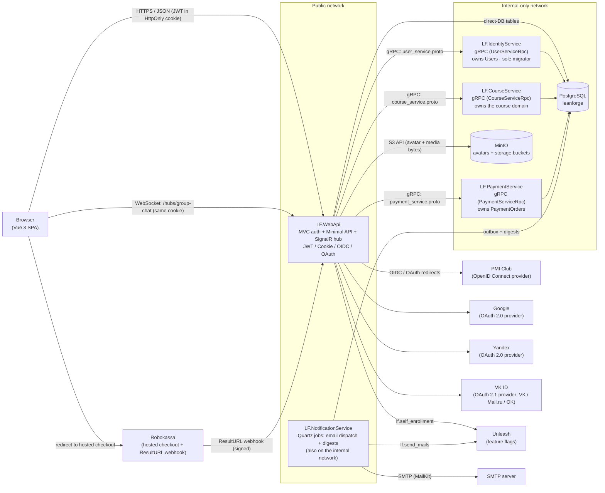
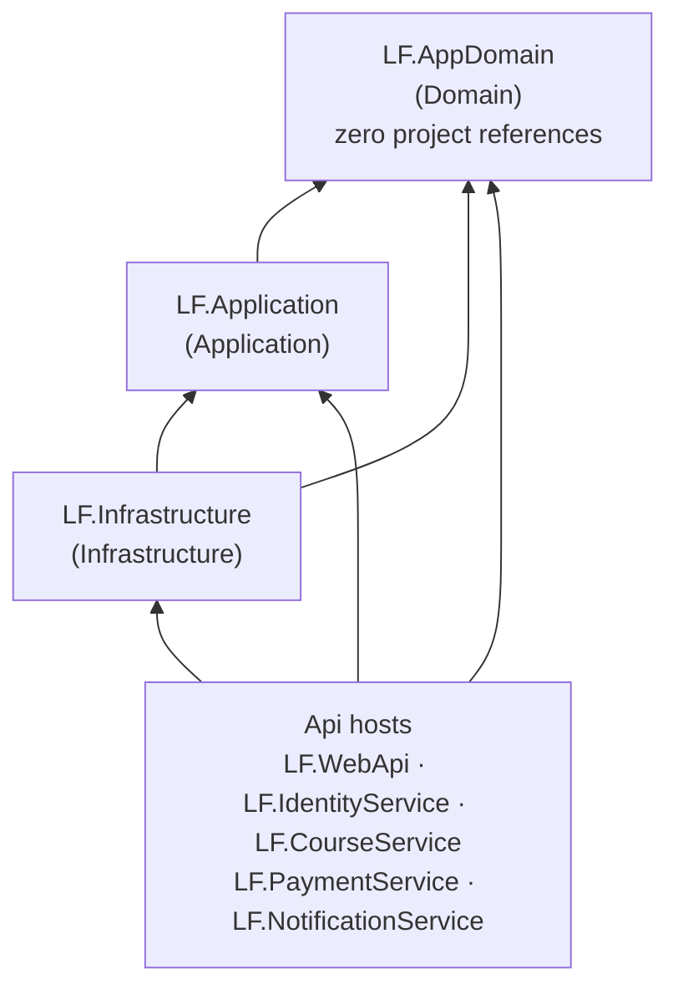

# Lean Forge LMS — Architecture

This document describes how Lean Forge LMS is built. For what the project is and how to
get it running quickly, see [`README.md`](./README.md). For contributor conventions and
anti-patterns, see [`CLAUDE.md`](./CLAUDE.md).

## Overview

Lean Forge LMS runs as **five independently deployable ASP.NET Core processes** plus a Vue 3
single-page app, backed by one PostgreSQL database and one MinIO object store:

- **`LF.WebApi`** — the only public-facing process. Hosts the SPA, the authentication
  pipeline (MVC controllers), the Minimal API surface and the group-chat SignalR hub. Acts as a
  BFF / gateway.
- **`LF.IdentityService`**, **`LF.CourseService`**, **`LF.PaymentService`** — internal
  gRPC-only services, each the single owner of one slice of the domain.
- **`LF.NotificationService`** — a background worker with no public API. It delivers the email
  outbox over SMTP and builds course-update digests on Quartz.NET schedules.

Stack: **.NET 10 / C# 14**, EF Core + Npgsql, gRPC for inter-service calls, SignalR for live
chat, MinIO for blobs, Robokassa for payments, MailKit + Quartz.NET for email, Unleash for
feature flags. **.NET Aspire** orchestrates everything for local development; **Docker
Compose** is the production deployment.

Within every service, code follows **Clean Architecture** with dependencies pointing
strictly inward (`Domain ← Application ← Infrastructure ← Api`).

## Service topology

- **`LF.WebApi`** — hosts the Vue SPA, the JWT/Cookie/OIDC/OAuth authentication pipeline
  (MVC controllers), the Minimal API surface (`IEndpointGroup`s, auto-discovered) and the
  SignalR hub for group chat. It reaches the three gRPC services only through their contracts,
  and reads/writes directly only the tables listed under
  [the direct-DB exceptions](#the-direct-db-exceptions). It is the only process that talks to
  MinIO, and one of two that talk to Unleash.
- **`LF.IdentityService`** — internal gRPC service that owns all user identity data
  (`Users`, including each user's preferred email language). It is also the **sole schema
  owner/migrator** for the shared database.
- **`LF.CourseService`** — internal gRPC service that owns the course domain: courses,
  categories, chapters, lessons (text / media / quiz / files parts), enrollments, quiz
  attempts, and promo codes. Inside the same unit of work it also *stages* enrollment
  confirmation emails into the outbox and records lesson changes for update digests (see
  [Email notifications](#email-notifications)).
- **`LF.PaymentService`** — internal gRPC service that owns payment orders (`LFPaymentOrders`)
  and the Robokassa integration (signed checkout-URL construction, ResultURL/SuccessURL
  signature verification). It knows nothing about courses or enrollments — `LF.WebApi`
  orchestrates the two after a payment settles.
- **`LF.NotificationService`** — background host (plain HTTP/1.1, no gRPC, no public API). Two
  Quartz.NET jobs: `EmailDispatchJob` sends due outbox rows (`LFEmailMessages`) over SMTP
  (MailKit), and `CourseUpdateDigestJob` turns pending lesson changes into one digest email
  per course. It needs SMTP and Unleash egress, so it is the one internal service that also
  sits on the public network.
- **PostgreSQL** (`leanforge`) — one database, shared by all five hosts; each host only
  ever touches the tables it owns.
- **MinIO** — S3-compatible object storage, reachable only from `LF.WebApi`, never from the
  browser. Two buckets: `avatars` (user avatars) and `storage` (course cover images,
  lesson media — image / video / audio / file blocks — and news images).


```mermaid
graph LR
    Browser["Browser<br/>(Vue 3 SPA)"]
    PMI["PMI Club<br/>(OpenID Connect provider)"]
    Google["Google<br/>(OAuth 2.0 provider)"]
    Yandex["Yandex<br/>(OAuth 2.0 provider)"]
    VkId["VK ID<br/>(OAuth 2.1 provider: VK / Mail.ru / OK)"]
    Robokassa["Robokassa<br/>(hosted checkout + ResultURL webhook)"]
    Unleash["Unleash<br/>(feature flags)"]
    Smtp["SMTP server"]

    subgraph Public["Public network"]
        WebApi["LF.WebApi<br/>MVC auth + Minimal API + SignalR hub<br/>JWT / Cookie / OIDC / OAuth"]
        NotificationSvc["LF.NotificationService<br/>Quartz jobs: email dispatch + digests<br/>(also on the internal network)"]
    end

    subgraph Internal["Internal-only network"]
        IdentitySvc["LF.IdentityService<br/>gRPC (UserServiceRpc)<br/>owns Users · sole migrator"]
        CourseSvc["LF.CourseService<br/>gRPC (CourseServiceRpc)<br/>owns the course domain"]
        PaymentSvc["LF.PaymentService<br/>gRPC (PaymentServiceRpc)<br/>owns PaymentOrders"]
        Postgres[("PostgreSQL<br/>leanforge")]
        Minio[("MinIO<br/>avatars + storage buckets")]
    end

    Browser -- "HTTPS / JSON (JWT in HttpOnly cookie)" --> WebApi
    Browser -- "WebSocket: /hubs/group-chat (same cookie)" --> WebApi
    Browser -- "redirect to hosted checkout" --> Robokassa
    Robokassa -- "ResultURL webhook (signed)" --> WebApi
    WebApi -- "OIDC / OAuth redirects" --> PMI
    WebApi --> Google
    WebApi --> Yandex
    WebApi --> VkId
    WebApi -- "lf.self_enrollment" --> Unleash
    WebApi -- "gRPC: user_service.proto" --> IdentitySvc
    WebApi -- "gRPC: course_service.proto" --> CourseSvc
    WebApi -- "gRPC: payment_service.proto" --> PaymentSvc
    WebApi -- "S3 API (avatar + media bytes)" --> Minio
    WebApi -- "direct-DB tables" --> Postgres
    IdentitySvc --> Postgres
    CourseSvc --> Postgres
    PaymentSvc --> Postgres
    NotificationSvc -- "outbox + digests" --> Postgres
    NotificationSvc -- "lf.send_mails" --> Unleash
    NotificationSvc -- "SMTP (MailKit)" --> Smtp
```

**Why the split exists.** Each internal service is the single owner of its slice of the
domain, and `LF.WebApi` reaches them exclusively through their gRPC contracts
(`user_service.proto`, `course_service.proto`, `payment_service.proto`). Course / chapter /
lesson / enrollment mutations always go through `LF.CourseService` because they carry real
business rules (ownership checks, publish invariants, quiz grading) that must not be
duplicated across processes. Payment settlement flows the same way: Robokassa's ResultURL
webhook lands on `LF.WebApi`, which calls `LF.PaymentService` (verify signature, settle the
order) and then `LF.CourseService` (`ConfirmEnrollmentPayment` — activate the enrollment,
redeem the promo code); both calls are idempotent, so a webhook retry is safe.
`LF.NotificationService` needs no contract at all: it communicates through the database (the
email outbox and the pending-change table).

### The direct-DB exceptions

Some tables are reached from `LF.WebApi` via `IAppDbContext` rather than a gRPC round-trip,
each for a deliberate reason. Where these features check course rules, they only *read* the
course-domain tables (`Courses`, `CourseInstructors`, `Enrollments`, `Users`); `LF.WebApi`
never writes course content or enrollments.

- **`StorageObjects`** (avatar / cover-image / lesson-media metadata) is a generic, ownerless
  table, and `LF.WebApi` is the only process with both a MinIO client and a reason to write
  it — so `IStorageService.UploadMediaAsync` does the MinIO upload and the metadata write in
  one call instead of two hops. `LF.CourseService` only ever *reads* `StorageObjects`.
- **`CoursePayments`** (the marketing payments ledger) is orchestration state: `LF.WebApi` is
  the coordinator that already has every join it needs (`Users`, `Courses`, `Enrollments`,
  `PromoCodes`, `PaymentOrders`) in a single `IAppDbContext`, so the ledger projection lives
  there.
- **`NewsPosts` / `NewsImages` / `NewsReadMarkers`** are platform content, not course domain,
  and every news image is a MinIO blob — the same reasoning as `StorageObjects`. See
  [News & notifications](#news--notifications).
- **`CourseInstructors`, `LessonQuestions` / `LessonQuestionMessages` /
  `LessonQuestionReadMarkers`** — the teaching team and lesson Q&A need course, lesson,
  enrollment and user joins in single queries and are used only by `LF.WebApi`. See
  [Teaching team & lesson Q&A](#teaching-team--lesson-qa).
- **Student groups, lectures and group chat** (`StudentGroups`, `StudentGroupMembers`,
  `Lectures`, `LectureGroups`, `GroupChatMessages`, `GroupChatReadMarkers`) — the same joins,
  plus a SignalR hub that can only live in the public process. See
  [Student groups, lectures & group chat](#student-groups-lectures--group-chat).
- **`EmailMessages`** (the outbox) — `LF.WebApi` only enqueues admin test emails;
  course-related emails are staged by `LF.CourseService`. `LF.NotificationService` is the only
  process that delivers them.

Ownership is enforced by convention (which host's `Program.cs` / DI wires up which use-case
services), not by database-level permissions.

## Clean Architecture layers


```mermaid
graph BT
    Domain["LF.AppDomain<br/>(Domain)<br/>zero project references"]
    App["LF.Application<br/>(Application)"]
    Infra["LF.Infrastructure<br/>(Infrastructure)"]
    Hosts["Api hosts<br/>LF.WebApi · LF.IdentityService · LF.CourseService<br/>LF.PaymentService · LF.NotificationService"]

    App --> Domain
    Infra --> App
    Infra --> Domain
    Hosts --> Infra
    Hosts --> App
    Hosts --> Domain
```

| Layer | Project | Responsibility |
|---|---|---|
| Domain | `LF.AppDomain` | Entities with behavior: users (`DbUser`); courses (`Course`, `Chapter`, `Lesson`, `LessonPart`, `LessonPartFile`, `Category`, `Enrollment`, `QuizQuestion`, `QuizOption`, `QuizAttempt`, `PromoCode`, `CourseInstructor`, `CourseContentChange`); payments (`PaymentOrder`, `CoursePayment`); storage (`StorageObject`); news (`NewsPost`, `NewsImage`, `NewsReadMarker`); Q&A (`LessonQuestion`, `LessonQuestionMessage`, `LessonQuestionReadMarker`); groups (`StudentGroup`, `StudentGroupMember`, `Lecture`, `LectureGroup`, `GroupChatMessage`, `GroupChatReadMarker`); email (`EmailMessage`). Enums: `UserRole`, `CoursePricingType`, `CourseEnrollmentMode`, `EnrollmentStatus`, `LessonPartType`, `QuestionType`, `PromoCodeDiscountType`, `CourseCoverType`, `CourseCoverColor`, `CourseContentChangeKind`, `PaymentOrderStatus`, `StorageObjectType`, `FileType`, `NewsVisibility`, `LessonQuestionStatus`, `QuestionAuthorRole`, `EmailMessageStatus`; plus the `UserLanguage` value helper. Zero project or framework references by design. |
| Application | `LF.Application` | Use-case services, DTOs, Mapster mapping configs, email templates (`Templates/Email`, embedded resources), and the abstractions Infrastructure or a host implements (`IAppDbContext`, `IFileStorageService`, `IFeatureFlagService`, `IPaymentGateway`, `IHtmlSanitizer`, `IEmailSender`, `IGroupChatNotifier`, `IGrpcIdentityService`, `IGrpcCourseService`, `IGrpcEnrollmentService`, `IGrpcPromoCodeService`, `IGrpcPaymentService`, `IStorageRepository`). No mediator/dispatcher library — endpoints call these services directly. |
| Infrastructure | `LF.Infrastructure` | EF Core (`AppDbContext`, Npgsql, one `IEntityTypeConfiguration` per entity, migrations), the gRPC clients to the three internal services, the MinIO-backed `IFileStorageService` (two keyed buckets), the Robokassa-backed `IPaymentGateway`, the Ganss-backed `IHtmlSanitizer`, the Unleash-backed `IFeatureFlagService`, the MailKit-backed `IEmailSender`, `StorageRepository` (the one deliberate repository), and `DatabaseInitializer` (migrations + seeding + backfill). Split into narrow DI extensions so each host wires only what it needs. |
| Api | `LF.WebApi`, `LF.IdentityService`, `LF.CourseService`, `LF.PaymentService`, `LF.NotificationService` | Host projects. `LF.WebApi` is ASP.NET Core MVC (auth controllers) + Minimal API (`IEndpointGroup`, auto-discovered) + the SignalR hub (whose `SignalRGroupChatNotifier` implements `IGroupChatNotifier`) — the only public-facing process. Three are bare gRPC hosts, internal-only. `LF.NotificationService` hosts the Quartz.NET jobs. |

**Use-case services, per host.** `LF.Application`'s DI is split by host, not one
`AddApplication()` — ASP.NET Core validates the whole DI graph at `Build()`, so a single
umbrella registration would crash whichever host doesn't have all the dependencies wired.
`LF.ApplicationTests/DependencyInjectionTests` builds each graph with `ValidateOnBuild`.

| Extension | Called by | Registers |
|---|---|---|
| `AddAuthenticationApplication()` | `LF.WebApi` | Auth & profile (`AuthenticationService`, `TokenService`, `ProfileService`); admin (`AdminUserService`, `AdminCourseService`, `PromoCodeAdminService`, `PaymentReportService`, `AdminNewsService`, `AdminLessonQuestionService`); gRPC-facing wrappers (`CourseAuthoringService`, `EnrollmentLearningService`); `StorageService`; `NewsService`; Q&A and teaching team (`LessonQuestionService`, `CourseTeachingTeamService`); groups (`TeachingCourseService`, `StudentGroupService`, `LectureService`, `GroupChatService`); `EmailQueue`; `GanssHtmlSanitizer`; `TimeProvider.System`. The host adds `IGroupChatNotifier`. |
| `AddUserApplication()` | `LF.IdentityService` | `UserService` |
| `AddCourseApplication()` | `LF.CourseService` | `CourseService`, `EnrollmentService`, `PromoCodeService`, `EnrollmentNotifier`, `CourseChangeTracker`, `EmailTemplateRenderer`, `GanssHtmlSanitizer`, `TimeProvider.System` (the host binds `AppUrlOptions` for email links) |
| `AddPaymentApplication()` | `LF.PaymentService` | `PaymentOrderService`, `TimeProvider.System` |
| `AddNotificationApplication()` | `LF.NotificationService` | `EmailDispatchService`, `CourseUpdateDigestService`, `EmailTemplateRenderer`, `TimeProvider.System` (the host binds `AppUrlOptions`) |

`LF.Infrastructure` mirrors the split: `AddInfrastructureDatabase` (`AppDbContext` +
`IAppDbContext` + `StorageRepository` + `DefaultAdmins` config, all five hosts),
`AddInfrastructureGrpcClient`, `AddInfrastructureCourseGrpcClient` (course + enrollment +
promo gRPC clients), `AddInfrastructurePaymentGrpcClient`, `AddInfrastructureRobokassa`,
`AddInfrastructureFileStorage` (both MinIO buckets + `MinioBucketInitializer`),
`AddInfrastructureFeatureFlags` (Unleash client; `LF.WebApi` and `LF.NotificationService`),
`AddInfrastructureEmail` (`SmtpOptions` + `MailKitEmailSender`; reports whether SMTP is
configured).

**One intentional deviation from textbook Clean Architecture:**

- **`AppDbContext` is registered in all five hosts**, but each only touches the tables it
  owns (`Users` / the course domain / `PaymentOrders` / the direct-DB tables / the email
  outbox and pending digests). Enforced by convention.

## Runtime & cross-cutting concerns

Everything below is provided by `LeanForgeLMS.ServiceDefaults` (`Extensions.cs`), referenced
by all five backend hosts via `builder.AddServiceDefaults()`.

- **Logging — Serilog, two-stage.** `Extensions.CreateBootstrapLogger()` runs *before*
  `WebApplication.CreateBuilder` so startup exceptions are captured; `AddServiceDefaults()`
  then wires the full logger (reads config + DI, `Microsoft.AspNetCore` demoted to Warning,
  colorized `AnsiConsoleTheme.Code` console). `app.UseDefaultRequestLogging()` collapses each
  request/RPC into one structured summary line, with the level escalating on failure — HTTP
  5xx or an unhandled exception → `Error`, HTTP 4xx → `Warning`. It also reads the gRPC
  `grpc-status` trailer (a failed RPC keeps HTTP 200): caller-fault codes
  (InvalidArgument / NotFound / AlreadyExists / PermissionDenied / FailedPrecondition /
  Unauthenticated) → `Warning`, any other non-zero status → `Error`. Health/liveness polling
  is demoted to `Verbose`.
- **Error monitoring — Sentry.** Wired once in `ServiceDefaults` for all five hosts (errors
  + light performance tracing: 100% sampled in Development, 10% otherwise). Enabled only when
  the `SENTRY_DSN` environment variable is set; the SDK stays dormant otherwise.
- **Telemetry — OpenTelemetry.** Traces (ASP.NET Core + HttpClient, health paths filtered
  out) and metrics (ASP.NET Core + HttpClient + runtime). Exported over OTLP when
  `OTEL_EXPORTER_OTLP_ENDPOINT` is set — which the Aspire dashboard does automatically in
  local dev.
- **Health checks.** A `self` liveness check tagged `live`. `/health` (all checks) and
  `/alive` (`live` only) are mapped **only in Development** — see the known
  [Aspire health-probe hang](#local-development). `LF.NotificationService` serves HTTP/1.1, so
  its probe works; the three gRPC hosts are HTTP/2-only.
- **Resilience & service discovery.** `ConfigureHttpClientDefaults` adds
  `AddStandardResilienceHandler()` (retry / circuit-breaker / timeout, Polly v8) and service
  discovery to every `HttpClient`, including the gRPC channels.
- **Feature flags — Unleash** (`LF.WebApi` and `LF.NotificationService` only, so *not* from
  `ServiceDefaults`; the three gRPC hosts have no egress and cannot reach Unleash). The
  `Unleash.Client` SDK lives in `LF.Infrastructure` behind the Application-layer
  `IFeatureFlagService` abstraction; flag names are constants in `LF.Application`'s
  `FeatureFlags`: `lf.self_enrollment` (checked in `LF.WebApi`, see
  [the enrollment kill-switch](#pricing-promo-codes--the-enrollment-kill-switch)) and
  `lf.send_mails` (checked by `LF.NotificationService` on every dispatch tick, see
  [Email notifications](#email-notifications)). `AddInfrastructureFeatureFlags(configuration)` binds the `Unleash` config
  section (`ApiUrl` — note the `/api/` suffix the SDK appends `client/features` to — `ApiKey`,
  `FetchTogglesIntervalSeconds`) and registers a singleton client that polls toggles in the
  background, so `IsEnabledAsync` is an in-memory lookup with no per-call I/O.
  `UnleashInitializer` (an `IHostedService`) resolves the client during startup because
  construction performs a blocking first fetch — that cost belongs to startup, not to the first
  user request. That synchronous fetch **throws** if it fails (`TaskCanceledException` when the
  server is unreachable, `UnleashException` when the API key is rejected), so
  `UnleashClientBuilder` catches those and falls back to a background-polling client: a bad key
  or a down Unleash can never stop a host from booting, flags just stay off until a later
  poll succeeds. When `ApiUrl`/`ApiKey` are missing or still the `"CHANGE_ME"`
  placeholder, a `DisabledFeatureFlagService` is registered instead and **every flag reads as
  off** — the DI graph still validates and the app still starts. The API key is never
  committed: `dotnet user-secrets` in dev, `Unleash__ApiKey` from `.env` in Docker, and an
  Aspire secret parameter (`unleash-api-key`, sourced from `UNLEASH_API_KEY`, forwarded to both
  hosts) for AppHost runs.
- **Security headers (prod only).** `LF.WebApi/Program.cs` applies
  `NetEscapades.AspNetCore.SecurityHeaders` outside Development: default security headers
  plus a Content-Security-Policy (`script-src 'self' https://www.googletagmanager.com`,
  `connect-src` widened to the Google Analytics collection hosts, `style-src 'self' 'unsafe-inline'`
  for Vue scoped styles, `img-src 'self' data: blob: https:`, `frame-ancestors 'none'`,
  `object-src 'none'`, upgrade-insecure-requests). The CSP is the defence-in-depth backstop
  for the sanitized rich-text render path.

## Authentication

The Login page offers four external identity providers — **PMI Club**, **Google**, **Yandex**
and **VK ID** (shown as three buttons: VK, Mail.ru, OK) — all funneling into the same temp-cookie handshake and the same JWT-minting step,
wired up with different ASP.NET Core handlers:

- **PMI Club** uses a generic `AddOpenIdConnect` scheme, because PMI is a custom OIDC
  provider with no dedicated ASP.NET Core package. The code exchange is done manually in an
  `OnAuthorizationCodeReceived` handler (discovery-document lookup + `Duende.IdentityModel.Client`),
  **including manually forwarding the PKCE `code_verifier`** the handler generated during the
  challenge — `AddOpenIdConnect` defaults `UsePkce = true`, and skipping this step is a real
  failure mode (`invalid_grant` from a PKCE-enforcing provider). `MapInboundClaims = false`.
- **Google** uses the dedicated `AddGoogle` handler, which does its own PKCE + token exchange
  + userinfo lookup internally — no manual code exchange. Its default `ClaimActions` are
  remapped so `sub` / `email` / `name` arrive as the same short claim types PMI produces,
  and `AuthController` doesn't special-case either provider.
- **Yandex** uses the `AddYandex` handler from `AspNet.Security.OAuth.Yandex` (aspnet-contrib
  / .NET Foundation) — same internal PKCE + token + userinfo shape as `AddGoogle`. It requests
  the `login:email` / `login:info` scopes and its `ClaimActions` are remapped the same way
  (`id` → `sub`, `default_email` → `email`, `real_name` / `display_name` → `name`).
- **VK ID** (id.vk.com) uses the `AddVkId` handler from `AspNet.Security.OAuth.VkId` (aspnet-contrib),
  which handles VK ID's mandatory PKCE and the `device_id` it returns on the callback and needs again
  for the token exchange. One VK ID app covers VK, Mail.ru and OK. `SignInVk?provider=vkid|mail_ru|ok_ru`
  stores the choice in the auth properties, and `OnRedirectToAuthorizationEndpoint` appends it as the
  authorize page's `provider` parameter. It requests the `email` scope, and its `ClaimActions` map
  `user_id` → `sub`, `email` → `email`, and `first_name` / `last_name` → `given_name` / `family_name`.
  `AuthController` prefers `given_name` / `family_name` when they're present and otherwise splits `name`.
  The VK ID app's redirect URL must be the handler's `CallbackPath` (`https://<host>/auth/signin-vk`),
  not the `/api/Auth/SignInVkCallback` action.

**Login flow:**

1. Browser hits `GET /api/Auth/SignInPmi`, `GET /api/Auth/SignInGoogle`,
   `GET /api/Auth/SignInYandex` or `GET /api/Auth/SignInVk` → `LF.WebApi` issues a `Challenge` against the corresponding
   provider, using a **temporary cookie sign-in scheme** to hold the handshake state.
2. The provider redirects back to `GET /api/Auth/SingInPmiCallback`,
   `GET /api/Auth/SignInGoogleCallback`, `GET /api/Auth/SignInYandexCallback` or
   `GET /api/Auth/SignInVkCallback`. `AuthController` reads the temp-cookie principal, extracts
   `sub` / `email` / name, and calls `AuthenticationService.AuthenticatePmiUserAsync` /
   `AuthenticateGoogleUserAsync` / `AuthenticateYandexUserAsync` / `AuthenticateVkUserAsync` — all
   thin wrappers, since the work is provider-agnostic. **If `sub` or `email` is missing** (for
   example, a VK user declined the email scope), the callback signs out of the temp cookie and
   redirects to `/login?error=email_required` instead. Accounts are matched by email, so going on
   without one could match or create the wrong account.
3. That call goes over gRPC to `LF.IdentityService` (`GetOrCreateUser`), which looks up or
   creates the `DbUser` row — matched by the claims alone, with no separate "provider" field,
   so PMI, Google, Yandex and VK ID sign-ins with the same email are the same account. **New users get
   `Role = Student`.**
4. `LF.WebApi` mints its **own JWT** (`TokenService.CreateWebJwtToken`, HMAC-SHA256) with
   `NameIdentifier`, `email`, and `role` claims, and writes it into an **`HttpOnly`,
   `SameSite=Lax` cookie** (`Secure` outside Development). It then signs out of the temp
   cookie and redirects to `/courses`.
5. `GET /api/Auth/Logout` (`[Authorize]`) deletes the cookie and redirects to `/`. There is no
   server-side revocation: a copied JWT stays valid until it expires (`JwtExpiresDays`,
   default 7).

**How the SPA authenticates.** The token is never readable by page scripts.
`lf.webapp/src/services/api.js` is just `axios.create({ baseURL: '/api', withCredentials: true })`
— the browser attaches the `HttpOnly` cookie automatically. `JwtBearerEvents.OnMessageReceived`
pulls the token out of that cookie server-side; the `Authorization: Bearer` header still
works as a fallback for API clients and `LF.WebApiTests`. The SPA's auth state comes from a
one-time probe: `authStore.ensureInitialized()` calls `GET /api/profile` once per app load
(gated in the router `beforeEach`), and `isAuthenticated` is simply "the probe returned a
user". Because the cookie *is* sent on `` and direct-navigation requests, authenticated
media (avatars, cover images, lesson media) could load via a plain `` — the SPA
still fetches them as a blob and builds an object URL so the same code path works for the
header-only API-client case and to keep media requests off the SPA's shared `axios`
instance/interceptors.

JWT Bearer is the default authenticate/challenge scheme for the rest of the API; the
OIDC/OAuth and temp-cookie schemes exist solely to complete the external handshake. A
vestigial `AddCookie("LfAuthCookie")` scheme is registered but unused (auth rides on
JWT-bearer-reads-cookie). This wiring in `LF.WebApi/Program.cs` is deliberately fragile
(specific cookie/OIDC/JWT interplay) and isn't changed casually.

**Role-based authorization.** Two policies in `Program.cs`, additive on top of the scheme
wiring:

```csharp
.AddPolicy("AdminOnly",           p => p.RequireClaim(ClaimTypes.Role, nameof(UserRole.Admin)))
.AddPolicy("CourseCreatorOrAdmin", p => p.RequireClaim(ClaimTypes.Role,
    nameof(UserRole.Instructor), nameof(UserRole.CourseCreator), nameof(UserRole.Admin)))
```

The JWT is issued with a literal `"role"` claim, but the JwtBearer handler's default
`MapInboundClaims = true` renames it to `ClaimTypes.Role` before the request's
`ClaimsPrincipal` is built — so the policies check `ClaimTypes.Role`, and checking the
literal `"role"` string would 403 everyone including admins.

**Preferred language.** Each user has a `PreferredLanguage` (`ru` / `en`, null until
chosen), stored by `LF.IdentityService`. The SPA's locale toggle saves it through
`PUT /api/profile/language` → the `UpdateUserLanguage` RPC, and on start-up
`authStore.ensureInitialized` applies the stored value (or uploads the current locale when
unset). Emails are rendered in this language.

### Development-only login shortcuts

`GET /api/dev-auth/{role}` (`role` = `Student`, `Instructor`, `CourseCreator`, or `Admin`)
is a **local development and testing convenience** — it ensures a fixed test persona
(email/name configured under `DevAuth` in `appsettings.Development.json`) exists with the
requested role, mints the same JWT cookie the real login issues, and redirects to `/courses`.
No UI; hit it directly.

**Excluded from production, not just hidden:**

- `DevAuthEndpoints.Map()` checks `IHostEnvironment.IsDevelopment()` and never calls `MapGet`
  when it's `false` — the route is structurally absent outside Development, not a guarded 404.
- `docker-compose.yml` sets `ASPNETCORE_ENVIRONMENT: Production` for every service; and
  ASP.NET Core's own default when the variable is unset is `Production` — a misconfigured
  deploy fails closed.
- The `DevAuth` persona config exists only in `appsettings.Development.json`, never in
  `appsettings.json` or `docker-compose.yml`.

## Course, category & enrollment domain

Owned entirely by `LF.CourseService`, exposed to `LF.WebApi` over `course_service.proto`:

- **`Course`** — title, short introduction, description, a `Category`, an ordered list of
  `Chapter`s (each with an ordered list of `Lesson`s), a `CoverType` / `CoverColor` / cover
  image, pricing and enrollment mode, and an `IsPublished` flag. `Publish()` enforces that a
  course needs at least one chapter and every chapter at least one lesson. The details (title,
  introduction, description, category, cover, pricing, enrollment mode) are edited on the course settings page
  (`PUT /api/courses/{id}`) and only while the course is unpublished.
- **Authoring rights** are ownership-based: only the course's creator (or an admin) can edit
  its content and settings. Assigned instructors (see
  [Teaching team & lesson Q&A](#teaching-team--lesson-qa)) answer questions and run groups and
  lectures, but cannot edit content.
- **`Lesson`** — a title plus an ordered list of `LessonPart`s (a legacy single `Content`
  HTML string is still supported for lessons authored before parts existed). Part types:
  - **Text** — rich HTML, server-sanitized on write (`IHtmlSanitizer` / Ganss) with an
    allow-list kept in sync with the SPA's DOMPurify config.
  - **Image / Video / Audio** — each referencing a `StorageObject`.
  - **Quiz** — one or more `QuizQuestion`s (single- or multiple-choice `QuestionType`) with
    `QuizOption`s and a pass-threshold percentage. Students submit answers; grading is
    server-side (`QuizAttempt.Grade`), a passing score marks the lesson complete, and every
    attempt is persisted (`QuizAttempts`).
  - **Files** — a list of downloadable attachments, each a `LessonPartFile` → `StorageObject`.

  `Lesson.ReplaceParts(...)` is a full bulk-replace — the whole ordered set is swapped in one
  call, matching how the editor batches local edits before saving. A lesson flagged
  `IncludeInPreview` is readable from the catalog preview (`/api/enrollments/catalog/{courseId}`)
  before enrolling.
- **`Category`** — a flat, admin-managed tag set. Seeded with a protected `Common` category
  (`IsDefault = true`, undeletable) plus starter categories (Backend, Frontend, DevOps,
  Design, Career). A category still assigned to a course can't be deleted.
- **`Enrollment`** — one row per (student, course), with per-lesson completion state and a
  `Status` (`Active` / `PendingPayment`). A user cannot enroll in a course they created —
  `EnrollmentService.EnrollAsync` rejects it (`SelfEnrollmentException` → `403`) and
  `BrowseCatalogAsync` excludes the acting user's own courses. This is an ownership check
  (`Course.CreatedByUserId`), not a role ban.

- **Enrollment mode.** `Course.EnrollmentMode` is `Open` or `Managed`. `Managed` is the
  "private course" concept: `EnrollmentService.EnrollAsync` refuses self-enrollment
  (`EnrollmentModeException` → `403`), and the catalog/preview responses carry `enrollmentMode`
  so `CourseDetailView` hides the Enroll CTA instead of letting a student discover the 403 by
  clicking. The only way in is an admin enrolling the student.

**Admin course management** (`/api/admin/courses`, `AdminOnly`) covers the operations the
authoring side deliberately does not:

- **Every course, not just the admin's own.** `GET /api/admin/courses` lists all courses
  (`ListCoursesAsync(isAdmin: true)`) with the **author** of each hydrated from
  `LF.IdentityService`, since the list mixes owners. *Edit* routes into the normal course editor
  (`CourseEdit`) — no separate admin editor exists, because `EnsureOwnership` already passes for
  an admin on every authoring mutation, so an admin can edit any course through the existing UI.
- **Manual enrollment is admin-only.** `POST /api/admin/courses/{id}/enrollments` is the single
  manual-enrollment path; `CourseService.EnrollUserAsync` throws `CourseAuthorizationException`
  for a non-admin even when they own the course. (This moved off `/api/courses/{id}/enrollments`,
  which previously allowed the course owner too.)
- **Removing a student** — `DELETE /api/admin/courses/{id}/enrollments/{enrollmentId}` deletes the
  enrollment and its `PaymentOrder`s, and reports `wasPaid`/`pricePaid` so the SPA can name the
  amount in its warning. **No refund is issued** — the payment stack has no refund path — and the
  `CoursePayment` ledger row survives.
- **Unpublishing** — `POST /api/admin/courses/{id}/unpublish` takes a course out of the catalog;
  existing enrollments keep their row but its content is withheld.
- **Deleting a course** — `DELETE /api/admin/courses/{id}` is a hard delete. It **refuses with 409
  when any student has actually paid** (`Active` *and* `PricePaid > 0`; a `PendingPayment` row
  carries a price but no money moved) unless `?force=true`. The removal order is forced by the
  schema: enrollments (cascading `QuizAttempt`s) → `PaymentOrder`s → course-scoped `PromoCode`s
  (`Restrict`, and `Enrollment.PromoCodeId` is `Restrict` too) → the course (cascading
  chapters/lessons/parts) → the orphaned `StorageObject` rows. Because `LF.CourseService` has no
  MinIO client, the RPC **returns the orphaned object keys** and `AdminCourseService` (in
  `LF.WebApi`) deletes the blobs best-effort afterwards — a storage failure is logged, never
  surfaced as a failed delete, since the rows are already gone.

Student names on the roster are hydrated in `AdminCourseService` via
`ListUsersByIds` on `user_service.proto`: `LF.CourseService` owns enrollments but only knows a
scalar `UserId`, so a user deleted from the identity store still lists (without a name) rather
than vanishing.

The student side (`/api/enrollments`), the authoring side (`/api/courses`) and the admin side
(`/api/admin/courses`) are separate endpoint groups with separate audiences — see
[API surface](#api-surface).

## Teaching team & lesson Q&A

- **Teaching team.** A course's staff is its creator plus the instructors assigned to it
  (`CourseInstructor`, `LFCourseInstructors`). The creator is staff implicitly and is never
  stored as an assignment. Only the creator or an admin manages the team
  (`/api/courses/{courseId}/instructors`, `CourseTeachingTeamService`, in the course settings
  page). Only users whose role is Instructor, CourseCreator or Admin can be assigned.
  `CourseAccessExtensions.IsTeachingStaffAsync` / `StaffCourseIds` are the shared predicates
  for Q&A, groups, lectures and chat. `GET /api/teaching/courses` lists every course a user
  teaches (created or assigned) for the Teaching tab.
- **Lesson Q&A.** A student with an **Active** enrollment asks a question about a lesson; it
  becomes a private thread (`LessonQuestion` + `LessonQuestionMessage`s) between that student
  and the course's teaching staff. Threads are `Open` / `Answered` / `Closed`: a staff reply
  marks the thread answered, and a student follow-up reopens it. Bodies are plain text, never
  HTML. Messages are soft-deleted, so a moderated thread keeps its shape.
  - Endpoints: `LessonQuestionEndpoints` (`/api/questions`, plus `/api/lessons/{lessonId}/questions`
    for the panel on the lesson page). The inbox has a student scope and a staff scope, with
    per-course and per-status totals.
  - Unread state: one `LessonQuestionReadMarker` per (thread, viewer). A thread is unread when
    someone else wrote its newest message after the viewer's marker. The SPA shows the count as
    a header badge (`/questions`).
  - Admins moderate every thread from **Admin → Q&A** (`/api/admin/questions`: list, reply, delete a
    message, delete a thread).
  - Authorization is per course and lives in the services; `QuestionAuthorizationException`
    maps to 403.

## Pricing, promo codes & the enrollment kill-switch

**Pricing.** A `Course` is `Free` or `Paid` (`CoursePricingType`, with a positive ruble
`Price`). Enrolling in a free course yields an `Active` enrollment immediately; a paid course
yields a `PendingPayment` one that is locked (`403` on any content read) until payment
settles. `PromoCode`s (admin-managed, percentage or fixed-amount, optional course scope /
expiry / redemption cap) are validated at enrollment time and redeemed only once the payment
is confirmed.

**The global enrollment kill-switch.** Self-enrollment is gated by the **Unleash** flag
`lf.self_enrollment`, toggled from the Unleash UI without a redeploy or a database write. There
is no admin settings screen and no settings table — runtime configuration is not application
state.

- **Fails closed.** `IFeatureFlagService.IsEnabledAsync` reports every flag as off when the
  Unleash server is unconfigured, unreachable, or has not answered yet, so a fresh or degraded
  deployment lets students sign in and browse/preview courses but not enroll.
- **Enforcement — one point.** `EnrollmentLearningService.EnrollAsync` (`LF.Application`,
  registered only by `AddAuthenticationApplication()`, so it runs inside `LF.WebApi`) checks the
  flag before the gRPC hop and throws `EnrollmentDisabledException` when off. That exception
  extends `InvalidOperationException`, so it rides the existing plumbing to **HTTP 409** with
  the message, covering both self-enroll (`POST /api/enrollments`) and paid checkout
  (`POST /api/payments/checkout`) — the two paths that funnel through that method.
  Admin "managed" enrollment (`POST /api/admin/courses/{id}/enrollments`) is a different
  method and is **not** gated.
- **Why not in `LF.CourseService`.** That is where the guard used to live, but the three gRPC
  hosts run on the `leanforge-internal` Docker network (`internal: true`, no egress) and cannot
  reach the Unleash server at all. `LF.WebApi` is the only host on `leanforge-public`, and it is
  the sole caller of the enrollment RPC, so gating at that boundary loses nothing in practice.
- **SPA.** `platformStore` reads `GET /api/platform/config` (fail-safe default: disabled) and
  `CourseDetailView` hides / disables the Enroll CTA when off; the 409 is defence-in-depth. The
  probe evaluates the same flag with the same user id as the guard, so the CTA and the actual
  outcome cannot disagree.

## Payments (Robokassa)

Paid enrollment uses **Robokassa** classic hosted checkout, owned by `LF.PaymentService`
(`payment_service.proto`) and orchestrated by `LF.WebApi/Endpoints/PaymentEndpoints.cs`
(`/api/payments`):

1. **Checkout** — `POST /api/payments/checkout` (authenticated) enrolls the student
   (creating or resuming a `PendingPayment` enrollment) and, for a paid course, creates a
   `PaymentOrder` (its integer `Id` is the Robokassa `InvId`) and returns the signed checkout
   URL. `LF.PaymentService` builds the URL to `auth.robokassa.ru/Merchant/Index.aspx` with
   `SignatureValue = HASH(MerchantLogin:OutSum:InvId[:Receipt]:Password1)` — hash algorithm
   (MD5 / SHA256 / SHA512, default SHA256) configurable to match the merchant cabinet. No
   outbound HTTP call; the browser navigates there.
2. **ResultURL webhook (authoritative)** — Robokassa calls
   `GET|POST /api/payments/robokassa/result` (anonymous, verified by
   `HASH(OutSum:InvId:Password2)`). `LF.WebApi` forwards it to `LF.PaymentService`
   (`ConfirmPayment` — verify signature, check the amount, settle the order) then to
   `LF.CourseService` (`ConfirmEnrollmentPayment` — `Enrollment.Activate`, `PromoCode.Redeem`),
   and replies with the plain-text body `OK<InvId>`. Both downstream calls are idempotent
   (`PaymentOrder.MarkPaid` returns `false` on replay; `Enrollment.Activate` no-ops when
   already `Active`), so Robokassa's retries are safe. **After a successful activation it also
   writes a `CoursePayment` ledger row** (best-effort, wrapped so a failure there can never
   fail the `OK<InvId>` reply — see below).
3. **Browser return** — Robokassa redirects to the SPA routes `/payments/success` /
   `/payments/fail` (`PaymentResultView.vue`); the success page polls
   `GET /api/payments/orders/{id}` until the order reports `Paid`, then sends the student into
   the course. Access is never granted off the browser redirect alone — only the ResultURL
   webhook activates the enrollment.

Optional 54-FZ fiscalization (`Receipt` JSON, one line item = the course) is a config-gated
block, off by default. Refunds and a reconciliation job for webhooks that never arrive are
not implemented. No Redis — order state and callback idempotency are handled by the
`LFPaymentOrders` status column and the domain guards above.

Robokassa secrets (`MerchantLogin`, `Password1`, `Password2`) are supplied to
`LF.PaymentService` via configuration (user-secrets in dev, `.env` / environment in
production) — never committed; `appsettings.json` ships `"CHANGE_ME"` placeholders. The
ResultURL (`https://<host>/api/payments/robokassa/result`) and Success/Fail URLs are
registered in the Robokassa merchant cabinet.

## Payments reporting (marketing)

`CoursePayment` (`LFCoursePayments`) is an append-only, denormalized ledger of settled course
payments, kept independent of the `PaymentOrder` / `Enrollment` / `Course` / `User`
lifecycles so the marketing history survives their edits or deletion. Each row snapshots:
payment-order id (unique), enrollment id, user id + email + name, course id + title, amount,
promo code, provider + provider operation id, paid-at, recorded-at.

- **Written** from the Robokassa webhook (`PaymentReportService.RecordCoursePaymentAsync`,
  idempotent on the unique `PaymentOrderId` index).
- **Self-healing** — `PaymentReportService.ReconcileAsync` fills any gap from settled
  `PaymentOrders` that lack a ledger row, and `DatabaseInitializer` runs the same backfill
  on startup, so the ledger is complete even for payments that predate the feature.
- **Admin.** `Admin → Payments` shows a paged preview (`GET /api/admin/payments`, with
  optional `from`/`to` date filters) and a **CSV download** (`GET /api/admin/payments/report.csv`):
  hand-rolled RFC 4180, `;`-delimited with a UTF-8 BOM so it opens cleanly in Russian-locale
  Excel (no CSV library in the stack). Both endpoints run `ReconcileAsync` first.

## News & notifications

Admins publish **news posts** — a title, a rich-text body and an ordered gallery of up to 10
images — from **Admin → News**. Each post is either **Public** or **MembersOnly** and can be
kept as a draft.

- **Ownership.** `LF.WebApi` owns `LFNewsPosts`, `LFNewsImages` and `LFNewsReadMarkers` directly
  through `IAppDbContext` (see [the direct-DB exceptions](#the-direct-db-exceptions)) — no gRPC contract is involved.
  `NewsService` (reading, unread state) and `AdminNewsService` (authoring) are registered by
  `AddAuthenticationApplication()`.
- **Domain.** `NewsPost` owns its invariants: title ≤ 200 characters, non-empty body, at most 10
  images, image storage objects only, no duplicates. `ReplaceImages` bulk-replaces the gallery
  (kept images keep their row, and therefore their URL) and returns the dropped storage object
  ids. `Publish` stamps `PublishedAt` on the **first** publish only, so unpublishing and
  republishing never resurfaces an old post as unread.
- **Body HTML** is sanitized on write with the same `GanssHtmlSanitizer` allow-list as lesson text
  and rendered through `v-safe-html`.
- **Images.** `POST /api/admin/news/images` uploads one PNG/JPEG/WEBP file (≤ 5 MB) to the
  `storage` bucket under `news/{guid}{ext}` and returns a `storageObjectId`; the editor sends the
  ordered ids on save. `AdminNewsService` accepts only `news/`-prefixed storage objects that are
  not attached to another post, so a course cover or lesson media file can never be published
  (or deleted) through news. Dropped and deleted images lose their `StorageObject` row in the
  same save; the blobs are then deleted best-effort, as in `AdminCourseService`.
- **Reading.**
  - `GET /api/news` and `GET /api/news/{id}` (anonymous) serve **public, published** posts
    only. They back the Home landing block (latest 3) and the public `/news` and `/news/:id`
    pages.
  - `GET /api/notifications` (authenticated) serves **every** published post. The SPA's
    **Notifications** section (`/notifications`) marks members-only posts with a badge.
  - `GET /api/news/{id}/images/{imageId}` is anonymous but gated per request:
    `isAdmin || (IsPublished && (Public || authenticated))`, otherwise 404, so a members-only
    post's existence isn't revealed. Because public images need no auth, the SPA renders news
    images with a plain `` rather than the blob/object-URL path used for other media.
- **Unread badge.** One `NewsReadMarker` row per user (`UserId` key, `LastSeenAt`). Unread means
  published with `PublishedAt > LastSeenAt` (everything, before the first visit).
  `GET /api/notifications/unread-count` feeds the header badge; opening Notifications calls
  `POST /api/notifications/mark-seen`, which only ever moves the marker forward.

## Email notifications

Email uses a **transactional outbox**: producers only insert `EmailMessage` rows
(`LFEmailMessages`), and `LF.NotificationService` delivers them.

- **Producing.** Inject `IEmailQueue` and call `EnqueueAsync` (optional `NotBefore` for a
  delayed send). Course-related emails are *staged* instead: they are added to the DbContext
  without saving, so they commit in the same `SaveChangesAsync` as the change that caused them.
  - **Enrollment confirmation.** `IEnrollmentNotifier.StageEnrollmentConfirmationAsync` runs
    wherever an enrollment becomes Active: free enrollment, paid activation (not for
    `PendingPayment`, and not on idempotent replays) and admin enrollment. All of these run in
    `LF.CourseService`.
  - **Course-update digests.** `CourseService` calls `ICourseChangeTracker` when a lesson is
    added, or when its title, content or parts *actually* change. `Lesson.Rename` /
    `UpdateContent` / `ReplaceParts` return `bool`, and `ReplaceParts` compares a fingerprint of
    the student-visible content, because the editor rebuilds every part on each save.
    Reordering and the preview flag are not tracked. The tracker keeps one pending
    `CourseContentChange` per lesson (`LFCourseContentChanges`), and only for published courses.
- **Templates.** `LF.Application/Templates/Email/{Name}.{ru|en}.html` (+ optional `.txt`), embedded
  with `WithCulture="false"`. Without that, MSBuild would move the `*.ru.html` files into a
  satellite assembly. `IEmailTemplateRenderer` takes the subject from `<title>`, HTML-encodes
  `{{Key}}` values in the body, allows raw caller-encoded markup through `{{{Key}}}`, throws on a
  missing value, and falls back to `ru`. Each email is rendered in the recipient's
  `PreferredLanguage`. Links use `AppUrlOptions` (`App:PublicBaseUrl`, validated at start-up).
- **Delivery.** `EmailDispatchJob` (Quartz.NET 4, `[DisallowConcurrentExecution]`, cron
  `EmailDispatch:Cron`, default every 30 s) runs `IEmailDispatchService.DispatchDueAsync`, which
  sends due rows through `IEmailSender` (`MailKitEmailSender`).
  - **Retries.** Retry, backoff and the attempt cap live on the entity (`EmailMessage.RecordFailure`).
    The sender maps transport errors to `EmailDeliveryException(IsTransient)`: SMTP 5xx is
    permanent (`Failed`), everything else retries.
  - **Kill-switch.** Every dispatch tick checks the Unleash flag `lf.send_mails`; while it is off,
    due mail just stays `Pending`.
  - **Single replica** by design: there is no row locking.
- **Digests.** `CourseUpdateDigestJob` (`CourseUpdateDigest:Cron` / `QuietPeriodMinutes` /
  `MaxCoursesPerRun`) sends one digest per course once its newest pending change is older than
  the quiet period (default 30 min), so an editing session becomes one email.
  - Recipients are Active enrollments that existed before the last change, each emailed in
    their own language with a `/courses/learn/{enrollmentId}` link.
  - The emails and the `NotifiedAt` marks commit in one `SaveChanges` per course.
  - Changes to a course that is unpublished at digest time are discarded.
  - The job runs even without SMTP, because it only writes outbox rows.
- **Fails closed.** When `Smtp:Host` / `Smtp:FromAddress` are blank or `CHANGE_ME`, the dispatch
  job is never scheduled and queued mail stays `Pending`. SMTP settings: user-secrets
  `SMTP_HOST` / `SMTP_USERNAME` / `SMTP_PASSWORD` / `SMTP_FROM_ADDRESS` on the AppHost in dev,
  `Smtp__*` in `.env` for Docker.
- **Admin check.** `POST /api/admin/email/test` queues a test email, and
  `GET /api/admin/email/{id}` shows its delivery status.

## Course covers, lesson media & the Storage service

Course creators pick a cover when creating a course — a predefined solid color or an uploaded
image — and attach images / video / audio / files to lesson parts, all via one generic
storage abstraction:

- **`IStorageService` / `StorageService`** (`LF.Application/Services/Storage`, running inside
  `LF.WebApi`) exposes `UploadMediaAsync(StorageObjectType, ...)`: it uploads the file to the
  `storage` MinIO bucket via `IFileStorageService`, then persists a `StorageObject` metadata
  row via `IStorageRepository`, and returns both in one call. Object keys are
  `images/{guid}{ext}`, `videos/{guid}{ext}`, `audio/{guid}{ext}`.
- **`IStorageRepository` / `StorageRepository`** is a thin EF wrapper around
  `IAppDbContext.StorageObjects` — the only repository class in the codebase (an explicit,
  deliberate exception; every other entity is accessed via `IAppDbContext` / `DbSet<T>`).
- **Cover flow.** `POST /api/courses/cover-image` uploads the file and returns a
  `storageObjectId`; `POST /api/courses` references that id (image cover) or a
  `CourseCoverColor` enum value (color cover). `GET /api/courses/{id}/cover/image` streams the
  bytes back.
- **Lesson media flow.** `POST /api/courses/lesson-media` uploads one file — the target
  `StorageObjectType` is inferred from the content type. `POST /api/courses/lesson-files`
  uploads a batch of downloadable attachments. `PUT .../lessons/{id}/parts` then bulk-replaces
  the lesson's ordered part list, referencing already-uploaded media by id. Media streams
  back both from the authoring side (ownership-checked) and the enrollment side
  (`/api/enrollments/...`, enrollment-ownership-checked) so a student never needs authoring
  permissions to view a lesson they're enrolled in.
- Predefined colors (`CourseCoverColor`: Coral, Ocean, Forest, Amber, Slate, Berry) are
  backend-validated enum values; their hex values live as CSS custom properties
  (`--color-cover-*`) in the SPA, with light/dark variants.

## Object storage (MinIO)

- **Two buckets**, both provisioned by a small `IHostedService`
  (`MinioBucketInitializer`) on `LF.WebApi` startup: `avatars` (user avatars) and `storage`
  (course cover images + lesson media). They are two `IFileStorageService` instances — the
  `storage` one is keyed (`[FromKeyedServices("storage")]`) via .NET keyed DI.
- **Avatar upload** (`POST /api/profile/avatar`) validates content-type (PNG/JPEG/WEBP) and
  size (≤5 MB), stores under `avatars/{userId}/{guid}{ext}`, persists the key over gRPC, and
  deletes the previous object. Download falls back to a bundled default SVG.
- **Lesson media** accepts PNG/JPEG/WEBP/GIF images (≤5 MB), MP4/WEBM video (≤200 MB), or
  MPEG/WAV/OGG/WEBM audio (≤50 MB) — content type alone picks the type and the limit. The
  video/audio limits are current defaults, not product-reviewed.
- MinIO is never reachable from the browser — the same internal-only-network posture as
  Postgres.

## Student groups, lectures & group chat

Teaching staff split a course's students into **groups**, schedule **online lectures** for those
groups, and talk to them in a **per-group chat**. Students see their groups, a lecture schedule,
and the chat.

- **Ownership.** `LF.WebApi` owns the six tables directly through `IAppDbContext`; there is no
  gRPC contract and `course_service.proto` is unchanged. The use-case services are
  `IStudentGroupService`, `ILectureService`, `IGroupChatService` and `ITeachingCourseService`,
  all registered by `AddAuthenticationApplication()`.
- **Who manages what.** "Teaching staff" of a course means its creator (`Course.CreatedByUserId`)
  plus every assigned instructor (`LFCourseInstructors`). Staff and admins create, rename and
  delete groups, add and remove members, and schedule, edit, cancel and delete lectures.
  Authorization is per course and lives in the services, because the global Instructor role
  says nothing about a particular course. Services throw `GroupAuthorizationException`, which
  endpoints map to 403.
- **Who sees what.** A student sees a group only while they are a member **and** their enrollment
  in its course is Active (`CourseAccessExtensions.MemberGroupIds`). Enrollment removal happens in
  `LF.CourseService` and never touches group rows; access simply disappears with it, so no
  cross-host cleanup is needed. Staff still see such members, flagged "not enrolled".
- **Domain.**
  - `StudentGroup` owns its members. Names are unique per course. A student can belong to
    several groups of the same course, and only actively enrolled students can be added.
  - `Lecture` stores a UTC `StartsAt`, a duration of 5-600 minutes, an optional external
    `MeetingUrl` (absolute http/https only, because it is rendered as a link), and the groups it
    targets. All targeted groups must belong to the lecture's course. The LMS hosts no video.
    `Cancel` is one-way, and a cancelled lecture hides its link.
  - `GroupChatMessage` is plain text (at most 4000 characters, never HTML) and is soft-deleted.
    `GroupChatReadMarker` keeps the highest message id each user has seen, per group.
- **Teaching list.** `GET /api/teaching/courses` returns the courses a user created **or** was
  assigned to. The gRPC `ListCourses` is owner-only, which used to hide courses from assigned
  instructors. Assigned instructors manage groups and lectures but still cannot open the content
  editor (`CanEditContent`).
- **Chat transport.** Messages are **written over REST** (`GroupChatEndpoints`), so validation,
  authorization and error mapping stay in one place. They are **pushed over SignalR**: the
  `GroupChatHub` at `/hubs/group-chat` is push-only (`JoinGroup`/`LeaveGroup`, then the
  `messagePosted`/`messageDeleted` events).
  - **Auth.** The hub authenticates with the same HttpOnly session cookie, sent on the
    same-origin WebSocket handshake, so no query-string token is needed. It is mapped with
    `CloseOnAuthenticationExpiration`, so an open connection is closed when its JWT expires.
  - **Delivery.** `JoinGroup` checks access and records the connection, user and group in the
    in-process `GroupChatConnectionRegistry`. Every push is re-filtered against the group's
    *current* readers, computed by `GroupChatService`. A connection whose user has lost access
    (removed from the group, or enrollment removed) stops receiving and is dropped from the
    registry.
  - **Failures.** Pushes run after the database commit, behind the Application-layer
    `IGroupChatNotifier` (implemented by `SignalRGroupChatNotifier`). They are bounded by a
    5-second delivery timeout that is independent of the author's request. A push failure is
    logged and never fails the request; clients catch up from history.
  - **Viewer-neutral pushes.** Pushes carry `IsMine=false`. The SPA recognises its own messages
    by comparing `authorUserId` with the `viewerUserId` returned by the history endpoint.
- **Unread badge.** `GET /api/groups/unread` counts other people's undeleted messages above each
  group's read marker, for groups the user belongs to or teaches.
  `POST /api/groups/{id}/messages/read` only ever moves the marker forward.
- **SPA.**
  - Students get **Schedule** (`/schedule`): an agenda by day, with Join enabled from 15 minutes
    before the start. They also get **Groups** (`/groups`) and the group chat
    (`/groups/:groupId/chat`).
  - Staff get `/teaching/:courseId/groups` and `/teaching/:courseId/lectures`, linked from
    Courses -> Teaching.
  - `src/services/groupChatHub.js` holds one shared connection with automatic reconnect.
    Join and leave are serialized per group with per-caller ownership handles.
- **Single replica.** The registry and SignalR's connection state are in-process, so live
  delivery is correct only while `LF.WebApi` runs as one instance. Scaling out needs a backplane
  and a shared registry. REST and history stay correct either way.

## API surface

New endpoints are Minimal API `IEndpointGroup`s in `LF.WebApi/Endpoints/`, auto-discovered by
reflection in `Program.cs` (`MapEndpointGroups`). Existing auth is MVC (`AuthController`).
Where a route needs per-course rights (teaching staff, enrolled student), the policy only
requires authentication and the service enforces the rest.

| Endpoint group | Route prefix | Authorization |
|---|---|---|
| `ProfileEndpoints` | `/api/profile` (incl. `/language`, `/avatar`) | authenticated |
| `CourseEndpoints` | `/api/courses` | `CourseCreatorOrAdmin` (Instructor / CourseCreator / Admin) + ownership in `LF.CourseService` |
| `CourseInstructorEndpoints` | `/api/courses/{courseId}/instructors` | `CourseCreatorOrAdmin` + creator-or-admin in the service |
| `TeachingEndpoints` | `/api/teaching/courses` | `CourseCreatorOrAdmin` |
| `EnrollmentEndpoints` | `/api/enrollments` | authenticated |
| `LessonQuestionEndpoints` | `/api/questions`, `/api/lessons/{lessonId}/questions` | authenticated; enrolled student / teaching staff in the service |
| `StudentGroupEndpoints` | `/api/courses/{courseId}/groups`, `/api/groups` | authenticated; staff / active member in the service |
| `LectureEndpoints` | `/api/courses/{courseId}/lectures`, `/api/lectures` | authenticated; staff in the service (`/mine` for anyone) |
| `GroupChatEndpoints` | `/api/groups/{id}/messages`, `/api/groups/unread` | authenticated; staff / active member in the service |
| `GroupChatHubEndpoints` (SignalR) | `/hubs/group-chat` | authenticated; closed when the JWT expires |
| `PaymentEndpoints` | `/api/payments` | per route — `checkout` / `orders/{id}` authenticated; `robokassa/result` anonymous + signature-verified |
| `PlatformEndpoints` | `/api/platform/config` | authenticated |
| `NewsEndpoints` | `/api/news` | none — public posts only; the image route gates each request by post visibility |
| `NotificationEndpoints` | `/api/notifications` | authenticated |
| `AdminUserEndpoints` | `/api/admin/users` | `AdminOnly` |
| `AdminCategoryEndpoints` | `/api/admin/categories` | `AdminOnly` |
| `AdminCourseEndpoints` | `/api/admin/courses` | `AdminOnly` |
| `AdminPromoCodeEndpoints` | `/api/admin/promo-codes` | `AdminOnly` |
| `AdminPaymentReportEndpoints` | `/api/admin/payments` | `AdminOnly` |
| `AdminNewsEndpoints` | `/api/admin/news` | `AdminOnly` |
| `AdminLessonQuestionEndpoints` | `/api/admin/questions` | `AdminOnly` |
| `AdminEmailEndpoints` | `/api/admin/email` | `AdminOnly` |
| `DevAuthEndpoints` | `/api/dev-auth` | none — Development only, structurally absent otherwise |
| `AuthController` (MVC) | `/api/Auth/*` | `[AllowAnonymous]` sign-in/callback, `[Authorize]` logout |

Endpoints stay thin: they validate the request (FluentValidation, instantiated inline),
delegate to an Application-layer use-case service injected as a delegate parameter, and map
the result to a response DTO with `TypedResults`. There is no global exception handler: each
endpoint maps the feature's authorization exception to 403, `InvalidOperationException` to 409,
`ArgumentException` to a validation problem, and a `null` result to 404. There is no
mediator/dispatcher layer.

## Inter-service contracts (gRPC)

| Contract | Served by | Consumed by |
|---|---|---|
| `LF.IdentityService/Protos/user_service.proto` | `LF.IdentityService` (`RpcUserService`) | `LF.WebApi` (via `IGrpcIdentityService`) |
| `LF.CourseService/Protos/course_service.proto` | `LF.CourseService` (`RpcCourseService`) | `LF.WebApi` (via `IGrpcCourseService` / `IGrpcEnrollmentService` / `IGrpcPromoCodeService`) |
| `LF.PaymentService/Protos/payment_service.proto` | `LF.PaymentService` (`RpcPaymentService`) | `LF.WebApi` (via `IGrpcPaymentService`) |

`LF.NotificationService` has no contract; it shares only the database.
`LF.Infrastructure` references all three `.proto` files directly (as `Client`) — `LF.WebApi`
has no project reference to the gRPC hosts, only to `LF.Infrastructure`. A `.proto` change is
a cross-service boundary change: check the server (`Rpc*Service`) **and** the client wrapper
(`Grpc*Service` in `LF.Infrastructure`) before editing a message or RPC. `decimal` is carried
as an invariant-culture `string` over the wire.

The gRPC `Rpc*Service` classes map Application DTOs ⇄ proto and convert exceptions to
`RpcException(new Status(code, message))`; the client wrappers map the status back to a
domain exception or `null`. That chain is how, e.g., `EnrollmentDisabledException` in
`LF.CourseService` becomes an HTTP 409 in `LF.WebApi` with no new plumbing.

## Data & persistence

- **One shared PostgreSQL database** (`leanforge`). `AppDbContext` (Npgsql) implements
  `IAppDbContext`; Application-layer services depend on the interface. All five hosts register
  it. `DbSet`s:
  `Users`, `Courses`, `Categories`, `Enrollments`, `PromoCodes`, `PaymentOrders`,
  `CoursePayments`, `StorageObjects`, `QuizAttempts`, `NewsPosts`, `NewsReadMarkers`,
  `CourseInstructors`, `LessonQuestions`, `LessonQuestionReadMarkers`, `EmailMessages`,
  `CourseContentChanges`, `StudentGroups`, `Lectures`, `GroupChatMessages`,
  `GroupChatReadMarkers`. Other course entities, `NewsImage`, `LessonQuestionMessage`,
  `StudentGroupMember` and `LectureGroup` are mapped and reached through navigations.
- **Table-per-owner.** Table names are `"LF" + PascalPlural` (`LFUsers`, `LFCourses`,
  `LFPaymentOrders`, `LFCoursePayments`, …). Money is `numeric(12,2)`;
  enums are stored as `int`.
- **Cross-context references are bare indexed `int` columns, never real FKs** — a
  `PaymentOrder.EnrollmentId` or a `CoursePayment.CourseId` points across an ownership
  boundary, so it gets a `HasIndex` and nothing more. Navigations/FKs exist only *within* an
  owner's own tables (e.g. `Course` → `Chapter` → `Lesson`).
- **Entity configuration** is one `internal sealed IEntityTypeConfiguration<T>` per entity,
  auto-applied via `ApplyConfigurationsFromAssembly`.
- **Migrations** (`LF.Infrastructure/Migrations/`) — 20 to date, latest
  `20261006123417_AddStudentGroupsLecturesChat` (groups, members, lectures, lecture-group links,
  chat messages and chat read markers). Only `LF.IdentityService` applies
  them at runtime (`DatabaseInitializer.InitializeDatabaseAsync` → `Database.MigrateAsync()`),
  and it also seeds `DefaultAdmins` and the starter categories, and backfills `CoursePayments`.
  The other four hosts just connect and assume the schema is current
  (`LF.NotificationService` uses `WaitForStart(identityService)` under Aspire for that reason).

  ```bash
  dotnet ef migrations add <Name> \
    --project LF.Infrastructure \
    --startup-project LF.IdentityService \
    --context AppDbContext
  ```

  `LF.IdentityService` is the EF-tooling startup project — it carries
  `Microsoft.EntityFrameworkCore.Design` and has the simplest build-time dependency graph.

## Project structure

```
LeanForgeLMS.slnx
LeanForgeLMS.AppHost/            # .NET Aspire orchestration: postgres, minio, lf-webapp (Vite), the five
                                 #   .NET hosts, optional ngrok (payment-check profile)
LeanForgeLMS.ServiceDefaults/    # Shared Aspire defaults: Serilog, Sentry, OpenTelemetry, health
                                 #   checks, service discovery, HTTP resilience, request logging
LF.AppDomain/                    # Domain layer — Entities/{User,Course,Payment,Storage,News,Qna,Groups,Email},
                                 #   Models/{...}/Enums
LF.AppDomainTests/               # xUnit v3 unit tests for LF.AppDomain entities
LF.Application/                  # Application layer — Services/*, ModelDto/*, Common/{Interfaces,Access,
                                 #   Exceptions,Mapping,Options}, Templates/Email (embedded)
LF.ApplicationTests/             # xUnit v3 unit tests for LF.Application (Moq + MockQueryable.Moq)
LF.Infrastructure/               # Infrastructure — Persistence/ (AppDbContext, Configurations, Seed),
                                 #   Migrations/, Services/{Identity,Course,Enrollment,Promo,Payment,Storage,Email,...}
LF.WebApi/                       # Public host — MVC auth controllers, Endpoints/ (Minimal API),
                                 #   Hubs/ (group chat SignalR hub + connection registry),
                                 #   Common/ (CsvWriter, ClaimsPrincipal ext), Program.cs auth pipeline
LF.WebApiTests/                  # xUnit v3 tests — validators, endpoint discovery, CsvWriter, feature flags
LF.IdentityService/              # Internal gRPC host — Services/RpcUserService.cs, Protos/user_service.proto
LF.CourseService/                # Internal gRPC host — Services/RpcCourseService.cs, Protos/course_service.proto
LF.PaymentService/               # Internal gRPC host — Services/RpcPaymentService.cs, Protos/payment_service.proto
LF.PaymentServiceTests/          # xUnit v3 tests for the Robokassa gateway + RpcPaymentService
LF.NotificationService/          # Background host — Jobs/{EmailDispatchJob,CourseUpdateDigestJob} (Quartz.NET)
lf.webapp/                       # Vue 3 + Vite SPA (build output → LF.WebApi/wwwroot)
docker-compose.yml               # Self-contained Docker deployment (7 services, images built locally)
docker-compose.production.yml    # Production: prebuilt ghcr.io images behind the shared nginx-proxy
.github/workflows/               # tests.yml, webapp-tests.yml (PR checks); deploy-production.yml,
                                 #   sync-production-env.yml (manual)
DeploymentGuide.md               # Step-by-step production deployment
```

## Tech stack

| Concern | Choice |
|---|---|
| Runtime | .NET 10 / C# 14 |
| Web framework | ASP.NET Core — MVC (auth controllers) + Minimal APIs (`IEndpointGroup`, auto-discovered) |
| Local orchestration | .NET Aspire (AppHost + ServiceDefaults) |
| Inter-service RPC | gRPC (`Grpc.AspNetCore` / `Grpc.Net.Client`); contracts in the three `Protos/*.proto` files |
| Database | PostgreSQL via `Npgsql.EntityFrameworkCore.PostgreSQL`, one shared `leanforge` database, table-per-owner |
| Object storage | MinIO (`CommunityToolkit.Aspire.Hosting.Minio` + `.Minio.Client`), owned by `LF.WebApi` — `avatars` + `storage` buckets |
| Payments | Robokassa classic hosted checkout, owned by `LF.PaymentService` — raw signature hashing, no SDK, optional 54-FZ `Receipt` |
| Authentication | JWT Bearer (primary, delivered in an HttpOnly cookie) + temp Cookie + OpenID Connect (Duende.IdentityModel) against PMI Club + OAuth 2.0 (`Microsoft.AspNetCore.Authentication.Google`) against Google + OAuth 2.0 (`AspNet.Security.OAuth.Yandex`) against Yandex + OAuth 2.1 (`AspNet.Security.OAuth.VkId`) against VK ID (VK / Mail.ru / OK) |
| Object mapping | Mapster |
| Validation | FluentValidation (`LF.WebApi` only, instantiated inline) |
| HTML sanitization | `HtmlSanitizer` (Ganss) behind `IHtmlSanitizer`, in `LF.CourseService` (lesson HTML) and `LF.WebApi` (news posts). Q&A and chat bodies are plain text and never rendered as HTML. |
| Email | MailKit SMTP behind `IEmailSender` (`LF.Infrastructure`), transactional outbox in Postgres, `ru`/`en` HTML + text templates |
| Background jobs | Quartz.NET 4 (`Quartz.Extensions.Hosting`) in `LF.NotificationService` |
| Logging | Serilog (`Serilog.AspNetCore`), centralized in `ServiceDefaults`, colorized console, two-stage bootstrap, one summary line per request/RPC |
| Observability | OpenTelemetry traces + metrics via `ServiceDefaults`, OTLP export when `OTEL_EXPORTER_OTLP_ENDPOINT` is set |
| Error monitoring | Sentry (`Sentry.AspNetCore`), wired once in `ServiceDefaults`, enabled only when `SENTRY_DSN` is set |
| Real-time | ASP.NET Core SignalR (in-process, single replica) on `LF.WebApi`; `@microsoft/signalr` client in the SPA |
| Feature flags | Unleash (`Unleash.Client`) behind `IFeatureFlagService`, registered in `LF.WebApi` and `LF.NotificationService`; fails closed when unconfigured |
| Security headers | `NetEscapades.AspNetCore.SecurityHeaders` — prod-only CSP + default headers on `LF.WebApi` |
| Backend testing | xUnit v3 + Moq + MockQueryable.Moq (unit tests). Integration testing with Testcontainers / WebApplicationFactory is aspirational — not built. |
| Frontend | Vue 3 (Composition API, `<script setup>`) + Vite, Pinia, vue-router, vue-i18n (en/ru, default `ru`), Tailwind CSS v4, axios, a local shadcn-style component kit built on **reka-ui** + `class-variance-authority` in `src/components/ui/`, icons from `lucide-vue-next` |
| Frontend testing | Vitest + `@testing-library/vue` — component, Pinia store, and service suites, co-located as `*.spec.js` |
| Containerization | Multi-stage Dockerfiles; Docker Compose; images published to ghcr.io by a manual GitHub Actions deploy |

## Deployment topology (Docker Compose)

`docker-compose.yml` defines **seven services** across two Docker networks:

| Service | Network(s) | Host-exposed? |
|---|---|---|
| `postgres` | `leanforge-internal` | No |
| `minio` | `leanforge-internal` | No — media bytes are proxied through `lf-webapi` |
| `lf-identityservice` | `leanforge-internal` | No — gRPC only |
| `lf-courseservice` | `leanforge-internal` | No — gRPC only |
| `lf-paymentservice` | `leanforge-internal` | No — gRPC only (Robokassa's classic flow needs no egress from it) |
| `lf-notificationservice` | `leanforge-public` + `leanforge-internal` | No — public network for SMTP and Unleash egress only |
| `lf-webapi` | `leanforge-public` + `leanforge-internal` | Yes (`${WEBAPI_HOST_PORT:-8081}` → `8080`) |

`leanforge-internal` is `internal: true` (no egress). `lf-webapi` is the only container with a
published port — it needs outbound internet for the PMI OIDC / Google + Yandex + VK ID OAuth
handshakes and Unleash, and it receives Robokassa's ResultURL webhook. It also serves the
group-chat WebSocket (`/hubs/group-chat`). A reverse proxy in front of it must pass WebSocket
upgrades, and it must stay a **single replica**, because chat delivery state is in-process (see
[Student groups, lectures & group chat](#student-groups-lectures--group-chat)).
`lf-notificationservice` joins the public network only for SMTP and Unleash and has no
published port. `lf-courseservice` and `lf-notificationservice` both get `App__PublicBaseUrl` for
email links.

**There is no `lf-webapp` container** — `LF.WebApi/Dockerfile` is 3-stage: a `node:22` stage
builds the SPA into `LF.WebApi/wwwroot`, then the .NET SDK stage publishes it into the image.
The other four Dockerfiles are 2-stage (SDK build → aspnet runtime), no Node. In production
`LF.WebApi` serves the SPA via `MapFallbackToFile("index.html")`; in development it proxies
to the Vite dev server.

```bash
cp .env.example .env   # POSTGRES_PASSWORD, MINIO_ROOT_USER/PASSWORD, DefaultAuth__JwtKey,
                       # PmiAuth__*, GoogleAuth__*, YandexAuth__*, VkIdAuth__*, Robokassa__* (+ SuccessUrl/FailUrl),
                       # Unleash__ApiKey (blank = every flag off: no self-enrollment, no email delivery),
                       # Smtp__Host/Port/Security/UserName/Password/FromAddress/FromName (blank Host = no delivery).
                       # SENTRY_DSN is optional — blank disables Sentry.
docker compose up --build
```

**Production** uses `docker-compose.production.yml`: the same seven services, but it pulls
prebuilt images from `ghcr.io/toptuk/leanforgelms/*`. `lf-webapi` also joins the external
`pmi_network`, where a shared nginx-proxy terminates TLS (`VIRTUAL_HOST`), and it publishes only
on loopback. Deployment is the manual GitHub Actions workflow `deploy-production.yml`:
1. Run the backend tests and the webapp lint, tests and build.
2. Build and push the five images.
3. Copy the compose file to the server over SSH and roll it out.

`sync-production-env.yml` regenerates the server's `.env` from repository secrets.
Step-by-step instructions — server prep, secrets, verification, rollback and troubleshooting —
are in [`DeploymentGuide.md`](./DeploymentGuide.md).

## Local development

### Run everything via Aspire (recommended)

```bash
dotnet run --project LeanForgeLMS.AppHost
```

Starts Postgres, MinIO, the Vite dev server, and all five .NET hosts; wires connection
strings / service discovery automatically; opens the Aspire dashboard (OTEL traces / metrics
/ logs for every resource).

Email delivery is optional locally — without SMTP settings queued mail stays `Pending` (and
`lf.send_mails` must also be on). To send real mail, set the AppHost parameters once:

```bash
dotnet user-secrets set SMTP_HOST         smtp.example.com --project LeanForgeLMS.AppHost
dotnet user-secrets set SMTP_USERNAME     <user>           --project LeanForgeLMS.AppHost
dotnet user-secrets set SMTP_PASSWORD     <password>       --project LeanForgeLMS.AppHost
dotnet user-secrets set SMTP_FROM_ADDRESS noreply@example.com --project LeanForgeLMS.AppHost
```

Feature flags are optional locally — without a key every flag reads as off, which means
self-enrollment is blocked. To exercise it, set the Unleash client API token once:

```bash
# for `dotnet run --project LF.WebApi` (standalone)
dotnet user-secrets set "Unleash:ApiKey" "default:development.<secret>" --project LF.WebApi

# for `dotnet run --project LeanForgeLMS.AppHost` (forwarded as Unleash__ApiKey to lf-webapi
# and lf-notificationservice)
dotnet user-secrets set UNLEASH_API_KEY "default:development.<secret>" --project LeanForgeLMS.AppHost
```

> **Known issue.** `LF.IdentityService`, `LF.CourseService` and `LF.PaymentService` all set
> `Kestrel:EndpointDefaults:Protocols = Http2` (standard gRPC scaffolding), which also makes
> their `/health` endpoints HTTP/2-only. The AppHost's `WaitFor(...)` readiness probe uses
> HTTP/1.1 and gets rejected, so `lf-webapi` can hang indefinitely waiting to start. If it
> does: use the `payment-check` launch profile (which swaps `WaitFor` → `WaitForStart` for
> the gRPC dependencies), or run the services standalone (below). `lf-notificationservice`
> already uses `WaitForStart(identityService)` for the same reason.

### Testing payments locally (ngrok)

The `payment-check` AppHost launch profile starts everything the default profile does **plus**
an ngrok tunnel to `lf-webapi`, so Robokassa's server-to-server ResultURL webhook and the
browser Success/Fail redirects can reach your machine.

```bash
# one-time
dotnet user-secrets set NGROK_AUTHTOKEN <token> --project LeanForgeLMS.AppHost
dotnet user-secrets set "Robokassa:MerchantLogin" <shop-id>          --project LF.PaymentService
dotnet user-secrets set "Robokassa:Password1"     <test password #1> --project LF.PaymentService
dotnet user-secrets set "Robokassa:Password2"     <test password #2> --project LF.PaymentService

# each run (the free tunnel URL is ephemeral)
dotnet run --project LeanForgeLMS.AppHost --launch-profile payment-check
```

1. In the Aspire dashboard open the `ngrok` resource, copy its public URL `$PUB` (or open the
   ngrok inspector at `http://localhost:4040`).
2. In the Robokassa merchant cabinet → **Технические настройки**: Result URL
   `= $PUB/api/payments/robokassa/result` (method **POST**); Success URL
   `= $PUB/payments/success`; Fail URL `= $PUB/payments/fail`; hash algorithm **SHA256**
   (must match `Robokassa:HashAlgorithm`).
3. Open the app **at `$PUB`** (not `localhost` — the session cookie is per-origin), sign in
   via `$PUB/api/dev-auth/Student`, and buy a paid course.
4. Watch the `lf-webapi` / `lf-paymentservice` logs. On success `LFPaymentOrders.Status`
   becomes `Paid`, the enrollment becomes `Active`, a `LFCoursePayments` row is written, and
   the webhook replies `OK<InvId>`.

### Run services standalone (without Aspire)

```bash
dotnet run --project LF.IdentityService --no-launch-profile     # sole migrator; needs ConnectionStrings__leanforge
dotnet run --project LF.CourseService  --no-launch-profile      # same "leanforge" database
dotnet run --project LF.PaymentService --no-launch-profile      # + Robokassa__MerchantLogin/Password1/Password2
dotnet run --project LF.NotificationService --no-launch-profile # + App__PublicBaseUrl, optional Smtp__* / Unleash__*
dotnet run --project LF.WebApi         --no-launch-profile      # + PmiAuth/GoogleAuth/YandexAuth/VkIdAuth/DefaultAuth config,
                                                                #   Services__lf-*service__http__0 addresses,
                                                                #   DOTNET_SYSTEM_NET_HTTP_SOCKETSHTTPHANDLER_HTTP2UNENCRYPTEDSUPPORT=1
cd lf.webapp && npm run dev                                     # proxied by LF.WebApi in Development
```

## Testing & CI

```bash
dotnet build LeanForgeLMS.slnx
dotnet test                                    # LF.AppDomainTests, LF.ApplicationTests, LF.WebApiTests, LF.PaymentServiceTests
cd lf.webapp && npm run lint && npm test
```

- **Backend** — xUnit v3. `LF.AppDomainTests` (entity behavior), `LF.ApplicationTests`
  (use-case services with Moq + MockQueryable.Moq for `IAppDbContext`, plus DI-graph validation
  per host), `LF.WebApiTests` (FluentValidation validators, endpoint-group discovery,
  `CsvWriter`, feature-flag registration), `LF.PaymentServiceTests` (Robokassa gateway +
  `RpcPaymentService`). Testcontainers / WebApplicationFactory integration testing is planned,
  not yet built.
- **Frontend** — Vitest + `@testing-library/vue`; component, Pinia store, and service specs
  co-located as `*.spec.js`.
- **CI** — on every PR to `main`, `.github/workflows/tests.yml` runs `LF.ApplicationTests` and
  `LF.WebApiTests` (Release, TRX reports), and `.github/workflows/webapp-tests.yml` runs
  `npm ci` + `npm run lint:ci` + `npm run test:coverage` + `npm run build` when
  `lf.webapp/**` changes. The manual `deploy-production.yml` runs the **whole** backend suite
  and the webapp checks before it builds any image.

## Deferred / not yet built

- **Caching** — no HybridCache / Redis anywhere, payments included.
- **Inter-service messaging** — no Wolverine / MassTransit; gRPC direct calls, plus the
  database outbox for email.
- **Payment refunds** and a **reconciliation job** for ResultURL webhooks that never arrive.
- **Editing a published course's details** — settings are editable only while unpublished;
  content (chapters, lessons, parts) stays editable after publishing.
- **Lesson video/audio upload size limits** (200 MB / 50 MB) — current placeholders, not
  verified against Kestrel / dev-proxy request-body-size limits.
- **Group chat & lectures follow-ups** — lecture reminder emails (the email outbox already
  fits), recurring lectures, direct messages, chat attachments, and a SignalR backplane for
  running more than one `LF.WebApi` replica.
- **Session revocation** — logout only deletes the cookie; a copied JWT (and with it a
  REST call or chat connection) stays valid until it expires.
- **Multi-replica email dispatch** — the dispatcher has no row locking, so
  `LF.NotificationService` must run as one instance.
- **Orphaned uploads** — a news image (or course cover) uploaded in an editor that is then
  abandoned without saving keeps its `StorageObject` row and blob. No cleanup job exists yet.

