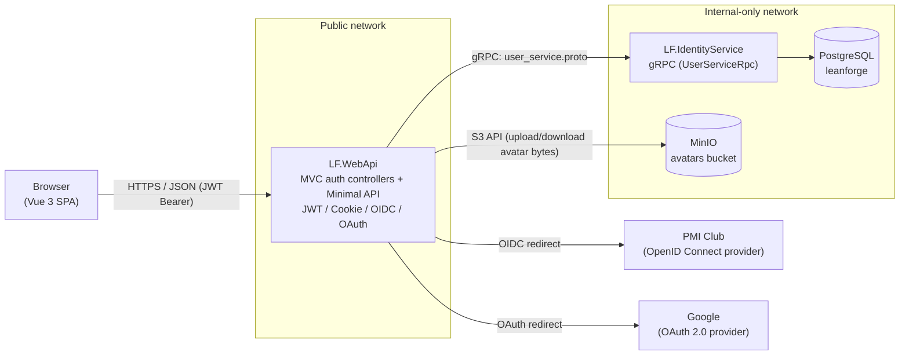
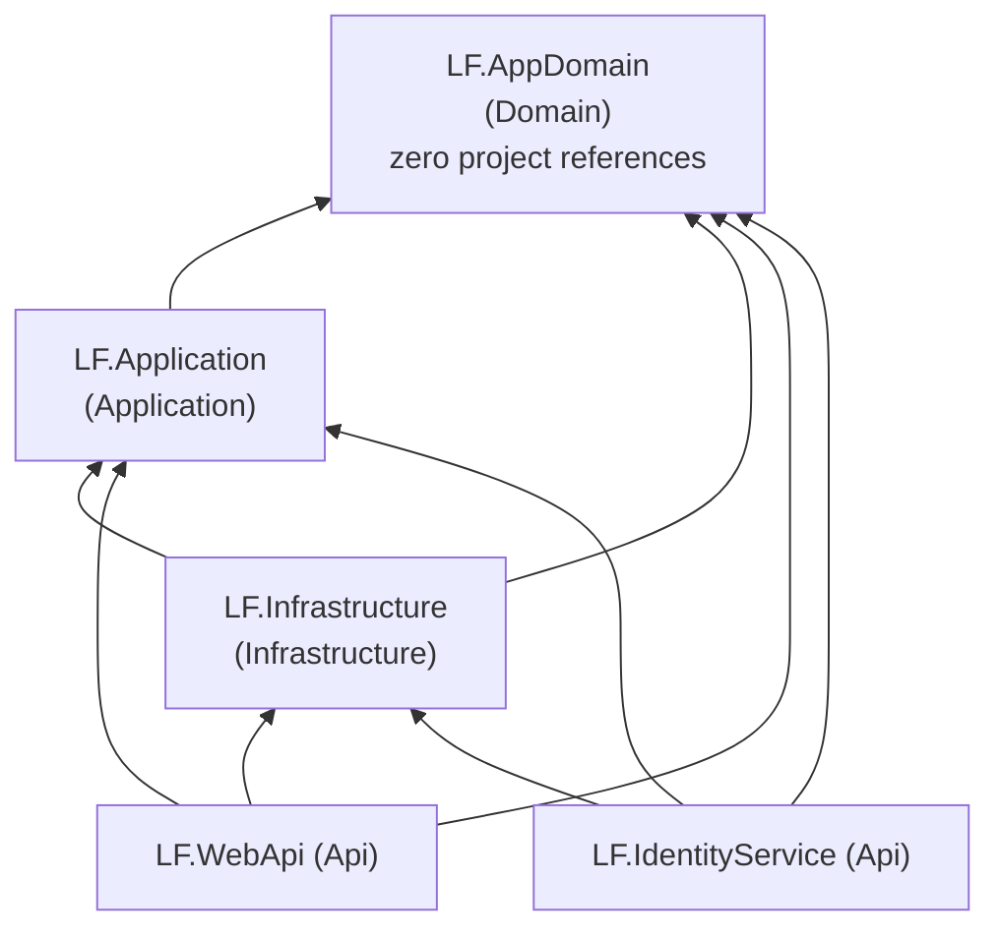

# Lean Forge LMS

Lean Forge LMS is a Learning Management System for an online school for developers. It's a solo-developer project built on **.NET 10** with a **Vue 3** SPA frontend, orchestrated locally with **.NET Aspire** and deployed to production as plain **Docker Compose** services.

The domain has moderate business rules (enrollment, progress tracking, grading, course lifecycle) — not CRUD-only, but not a rich DDD domain either. Today the implemented slice covers authentication, user identity, and profile/avatar management; the course/enrollment domain is not yet built out.

## Architecture

### Service topology

The system runs as **two independently deployable ASP.NET Core processes** plus the SPA, not a single monolith:

- **`LF.WebApi`** — the only public-facing process. Hosts the Vue SPA, the JWT/Cookie/OIDC authentication pipeline (MVC controllers), and the growing Minimal API surface (`IEndpointGroup`s). It never touches Postgres directly.
- **`LF.IdentityService`** — an internal gRPC-only service that owns the Postgres-backed `AppDbContext` and all user identity data. It is not reachable from outside the deployment network.
- **MinIO** — S3-compatible object storage for user avatar uploads. Only `LF.WebApi` talks to it; it is never exposed to the browser.



Why the split exists: `LF.IdentityService` is the single owner of user identity data and the Postgres connection. `LF.WebApi` reaches it exclusively through the shared `user_service.proto` gRPC contract — it has no `AppDbContext` registration of its own, even though it references `LF.Infrastructure`. Avatar files are the one exception to "WebApi never touches infrastructure directly": since MinIO needs no schema/migrations and `LF.WebApi` is the only process handling HTTP file uploads, it talks to MinIO directly via `IFileStorageService`, and only the resulting **object key** (not the file) is persisted in Postgres through the existing gRPC round-trip.

### Clean Architecture layers

Within each service, code follows Clean Architecture with dependencies pointing strictly inward:



| Layer | Project | Responsibility |
|---|---|---|
| Domain | `LF.AppDomain` | Entities with behavior (`DbUser`), enums (`UserRole`). Zero project or framework references by design. |
| Application | `LF.Application` | Use-case services (`UserService`, `ProfileService`, `AdminUserService`, `AuthenticationService`, `TokenService`), DTOs, Mapster mapping configs, and the abstractions Infrastructure implements (`IAppDbContext`, `IFileStorageService`, `IGrpcIdentityService`). No mediator/dispatcher library — endpoints call these services directly. |
| Infrastructure | `LF.Infrastructure` | EF Core (`AppDbContext`, Npgsql), the gRPC client to `LF.IdentityService`, and the MinIO-backed `IFileStorageService` implementation. Split into narrow DI extensions (`AddInfrastructureDatabase`, `AddInfrastructureGrpcClient`, `AddInfrastructureFileStorage`) so each host wires up only what it needs. |
| Api | `LF.WebApi`, `LF.IdentityService` | Host projects. `LF.WebApi` is ASP.NET Core MVC (existing auth) + Minimal API (`IEndpointGroup`, auto-discovered, new features). `LF.IdentityService` is a bare gRPC host. |

Two intentional deviations from "textbook" Clean Architecture, worth knowing about:

- **`AppDbContext` is registered in only one host.** `LF.WebApi` references `LF.Infrastructure` but never calls `AddInfrastructureDatabase()` — it has no direct database access. `LF.IdentityService` is the only process where `AppDbContext`/`IAppDbContext` are resolvable.
- **`LF.Application`'s DI is split by host, not one `AddApplication()`.** `AddAuthenticationApplication()` (auth/token/profile services, needs `IGrpcIdentityService`) is called only by `LF.WebApi`; `AddUserApplication()` (`UserService`, needs `IAppDbContext`) is called only by `LF.IdentityService`. ASP.NET Core validates the whole DI graph at `Build()`, so a single umbrella registration would crash whichever host doesn't have all the dependencies wired up.

### Authentication flow

The Login page offers two external identity providers — PMI Club and Google — both funneling into the same temp-cookie handshake and the same JWT-minting step, but wired up with different ASP.NET Core auth handlers:

- **PMI Club** uses a generic `AddOpenIdConnect` scheme (`LFPmiOidc`), because PMI is a custom OIDC provider with no dedicated ASP.NET Core package. The code exchange is done manually in an `OnAuthorizationCodeReceived` event handler (discovery document lookup + `Duende.IdentityModel.Client`), including manually forwarding the PKCE `code_verifier` the handler generated during the challenge — `AddOpenIdConnect` defaults `UsePkce = true`, and skipping this step is a real failure mode (`invalid_grant` from a provider that enforces PKCE, like Google would if it used this path).
- **Google** uses the dedicated `AddGoogle` handler (`Microsoft.AspNetCore.Authentication.Google`, scheme `LFGoogleOAuth`), which does its own PKCE + token exchange + userinfo lookup internally — no manual code exchange needed. Its default `ClaimActions` map to the long `ClaimTypes.*` claim URIs; `Program.cs` remaps `sub`/`email`/`name` to the same short claim types PMI's OIDC handler produces, so the callback parsing logic in `AuthController` doesn't need to special-case either provider.

1. Browser hits `GET /api/Auth/SignInPmi` or `GET /api/Auth/SignInGoogle` → `LF.WebApi` issues a `Challenge` against the corresponding provider, using a **temporary cookie sign-in scheme** to hold the handshake state.
2. The provider redirects back to `GET /api/Auth/SingInPmiCallback` or `GET /api/Auth/SignInGoogleCallback`. `AuthController` reads the temp-cookie principal, extracts `sub`/`email`/`name` claims, and calls `AuthenticationService.AuthenticatePmiUserAsync` or `AuthenticateGoogleUserAsync` — both are thin wrappers with identical shape, since the actual work is provider-agnostic.
3. That call goes over gRPC to `LF.IdentityService` (`GetOrCreateUser`), which looks up or creates the `DbUser` row (`Role = Student` by default for new users) — matched by the claims alone, with no separate "provider" field, so signing in with PMI and Google using the same email is treated as the same account.
4. `LF.WebApi` mints its **own JWT** (`TokenService.CreateWebJwtToken`) from the returned user, containing `NameIdentifier`, `email`, and `role` claims, and stores it in a **non-`HttpOnly` cookie** (`LfAuthCookie`) — deliberately readable by client-side JS.
5. The Vue SPA reads that cookie value directly (`js-cookie`) and attaches it as an `Authorization: Bearer` header on every `axios` call (see `lf.webapp/src/services/api.js`). This is why authenticated resources meant for ``/direct browser navigation (like the avatar endpoint) have to be fetched as a blob via `axios` and turned into an object URL — a plain `` request carries no bearer header.

JWT Bearer is the default authenticate/challenge scheme for the rest of the API; the OIDC/OAuth and temp-cookie schemes exist solely to complete the external handshake. This wiring in `LF.WebApi/Program.cs` is deliberately fragile (specific cookie/OIDC/JWT interplay) and isn't changed casually.

### Development-only login shortcuts

`GET /api/dev-auth/{role}` (`role` = `Student`, `Instructor`, `CourseCreator`, or `Admin`) is a **local development and testing convenience** — it ensures a fixed test persona (email/first/last name configured under `DevAuth` in `appsettings.Development.json`) exists with the requested role, mints the same JWT cookie the real PMI login issues, and redirects to `/courses` — reproducing a real login without needing a working OIDC provider. There is no UI for it; it's meant to be hit directly (browser address bar, curl, or an automated/E2E test).

**This is excluded from production, not just hidden:**

- `DevAuthEndpoints.Map()` (`LF.WebApi/Endpoints/DevAuthEndpoints.cs`) checks `IHostEnvironment.IsDevelopment()` and simply never calls `MapGet` when it's `false` — the route doesn't exist in the endpoint routing table at all outside Development (confirmed empirically: building the app with `EnvironmentName = "Production"` registers zero routes under `/api/dev-auth`, vs. one in `"Development"`). It's a structural absence, not a guarded 404.
- `docker-compose.yml` (the production deployment) explicitly sets `ASPNETCORE_ENVIRONMENT: Production` for both `lf-webapi` and `lf-identityservice`. Even without that, ASP.NET Core's own default when `ASPNETCORE_ENVIRONMENT` is unset is `Production` — so a misconfigured deploy fails closed, not open.
- The `DevAuth` persona configuration itself only exists in `appsettings.Development.json`, never in `appsettings.json` (the file that ships in the production image) or `docker-compose.yml`.

### Admin area

Users with `Role = Admin` get an "Administration" entry point in the SPA header (hidden from everyone else) leading to `/admin/users` — a Vuestic UI data table for listing, searching, editing, role-assigning, and deleting other users — plus an `/admin/courses` placeholder (no Course domain exists yet, so there's nothing to administer there).

- **Backend**: `LF.WebApi/Endpoints/AdminUserEndpoints.cs` (`/api/admin/users`, `RequireAuthorization("AdminOnly")`) calls `IAdminUserService` (`LF.Application/Services/Admin/AdminUserService.cs`) directly, which wraps `IGrpcIdentityService` — the same direct-injection shape as `ProfileService`, no mediator/dispatcher layer in between. Listing, role changes, and info edits go through the gRPC contract's `ListUsers`/`UpdateUserRole`/`UpdateUserProfile` RPCs; deletion goes through a new `DeleteUser` RPC — all added to `user_service.proto` alongside the existing ones.
- **Authorization**: an `AdminOnly` policy (`Program.cs`), additive on top of the existing JWT/Cookie/OIDC wiring: `RequireClaim(ClaimTypes.Role, nameof(UserRole.Admin))`. It checks `ClaimTypes.Role`, not the literal `"role"` claim the JWT is issued with — `JwtBearerHandler`'s default inbound claim mapping silently renames `"role"` → `ClaimTypes.Role` when building the request's `ClaimsPrincipal`, so checking the literal string would 403 everyone, including admins.
- **Self-protection**: an admin can't change their own role or delete their own account — `AdminUserService` throws `SelfAdministrationException`, mapped to `409 Conflict`, checked server-side and mirrored client-side (disabled row actions) so it can't be worked around by calling the API directly.
- **Testing without a real PMI/Google login**: the dev-login shortcut (`GET /api/dev-auth/{role}`) also accepts `Admin`, alongside the original Student/Instructor/CourseCreator personas.

### Avatar storage

- Bucket `avatars` in MinIO, provisioned by a small `IHostedService` (`MinioBucketInitializer`) on `LF.WebApi` startup.
- Upload (`POST /api/profile/avatar`) validates content-type (PNG/JPEG/WEBP) and size (≤5 MB), stores the file under a fresh `avatars/{userId}/{guid}{ext}` key, persists the key via `ProfileService.UpdateAvatarAsync` → gRPC → Postgres, and deletes the previous object.
- Download (`GET /api/profile/avatar`) streams the stored object, or falls back to a bundled default SVG (`LF.WebApi/wwwroot/images/default-avatar.svg`) when the user has no custom avatar — so "new users get a default avatar" requires no seeding step.
- `DELETE /api/profile/avatar` clears the reference and reverts to the default image.
- MinIO is never reachable from the browser, in Aspire dev orchestration or in `docker-compose.yml` — the same internal-only-network posture as Postgres.

## Project structure

```
LeanForgeLMS.slnx
LeanForgeLMS.AppHost/            # .NET Aspire orchestration: postgres, minio, lf-webapp (Vite), lf-identityservice, lf-webapi
LeanForgeLMS.ServiceDefaults/    # Shared Aspire defaults: OpenTelemetry, health checks, service discovery, HTTP resilience
LF.AppDomain/                    # Domain layer — Entities/User/DbUser.cs, Models/User/Enums/UserRole.cs
LF.Application/                  # Application layer — Services/{Authentication,Profile,User,Admin}, ModelDto/*, Common/Interfaces, Common/Mapping
LF.Infrastructure/                # Infrastructure layer — Persistence/AppDbContext.cs, Services/Identity (gRPC client), Services/Storage (MinIO)
LF.WebApi/                       # Public host — MVC auth controllers, Endpoints/ (Minimal API), Program.cs auth pipeline
LF.IdentityService/              # Internal gRPC host — Services/RpcUserService.cs, Protos/user_service.proto
LF.ApplicationTests/             # xUnit v3 unit tests for LF.Application (Moq + MockQueryable.Moq)
lf.webapp/                       # Vue 3 + Vite SPA
docker-compose.yml               # Production deployment (postgres, minio, lf-identityservice, lf-webapi)
```

## Tech stack

| Concern | Choice |
|---|---|
| Runtime | .NET 10 / C# 14 |
| Web framework | ASP.NET Core — MVC (existing auth) + Minimal APIs (`IEndpointGroup`, new features) |
| Local orchestration | .NET Aspire (AppHost + ServiceDefaults) |
| Inter-service RPC | gRPC (`Grpc.AspNetCore` / `Grpc.Net.Client`), contract in `LF.IdentityService/Protos/user_service.proto` |
| Database | PostgreSQL via `Npgsql.EntityFrameworkCore.PostgreSQL`, owned solely by `LF.IdentityService` |
| Object storage | MinIO (`CommunityToolkit.Aspire.Hosting.Minio` + `.Minio.Client`), owned solely by `LF.WebApi`, for avatar uploads |
| Authentication | JWT Bearer (primary scheme) + Cookie + OpenID Connect (Duende.IdentityModel) against PMI Club + OAuth 2.0 (`Microsoft.AspNetCore.Authentication.Google`) against Google |
| Object mapping | Mapster |
| Validation | FluentValidation (referenced in `LF.WebApi` today) |
| Logging | Serilog (`Serilog.AspNetCore`) |
| Observability | OpenTelemetry (traces + metrics) via `LeanForgeLMS.ServiceDefaults`, OTLP export when `OTEL_EXPORTER_OTLP_ENDPOINT` is set |
| Testing | xUnit v3 + Moq + MockQueryable.Moq (unit tests only today — Testcontainers/WebApplicationFactory integration testing is planned, not yet built) |
| Frontend | Vue 3 (Composition API) + Vite, Pinia, vue-router, vue-i18n (en/ru), Vuestic UI, Tailwind CSS v4, axios |
| Containerization | Multi-stage Dockerfiles (Node build → .NET SDK build → ASP.NET runtime), Docker Compose for production |

**Not yet decided / explicitly deferred:** caching (no HybridCache/Redis), inter-service messaging (no Wolverine/MassTransit — gRPC direct calls only), the course/enrollment domain itself.

## Getting started

### Prerequisites

- .NET 10 SDK
- Node.js 22.18+ (or 24.12+)
- Docker (for the Aspire-managed Postgres/MinIO containers, or for `docker-compose.yml`)

### Run everything via Aspire (recommended)

```bash
dotnet run --project LeanForgeLMS.AppHost
```

This starts Postgres, MinIO, the Vite dev server, `LF.IdentityService`, and `LF.WebApi`, wires connection strings/service discovery between them automatically, and opens the Aspire dashboard (OpenTelemetry traces/metrics/logs for every resource).

### Run services standalone (without Aspire)

```bash
# Identity service — needs its own Postgres connection string configured
dotnet run --project LF.IdentityService     # http://localhost:5296

# Web API — needs LF.IdentityService and MinIO reachable, and PmiAuth/GoogleAuth/DefaultAuth config set
dotnet run --project LF.WebApi              # http://localhost:5207

# Frontend dev server, proxied by LF.WebApi in Development
cd lf.webapp && npm run dev                 # http://localhost:5173
```

### Build & test

```bash
dotnet build LeanForgeLMS.slnx
dotnet test
cd lf.webapp && npm run lint
```

### Database migrations

`AppDbContext` is registered **only** in `LF.IdentityService` — use it as the startup project:

```bash
dotnet ef migrations add <Name> \
  --project LF.Infrastructure \
  --startup-project LF.IdentityService \
  --context AppDbContext
```

## Production deployment (Docker Compose)

`docker-compose.yml` defines four services across two Docker networks:

| Service | Network(s) | Host-exposed? |
|---|---|---|
| `postgres` | `leanforge-internal` | No |
| `minio` | `leanforge-internal` | No — avatar bytes are always proxied through `lf-webapi` |
| `lf-identityservice` | `leanforge-internal` | No — gRPC only, reached by `lf-webapi` |
| `lf-webapi` | `leanforge-public` + `leanforge-internal` | Yes (`${WEBAPI_HOST_PORT:-8081}` → `8080`) |

`lf-webapi` is the only container with a published port and the only one on the public network (it needs outbound internet access for the PMI OIDC and Google OAuth handshakes). Everything else is internal-only and unreachable from the host or the internet.

```bash
cp .env.example .env   # fill in POSTGRES_PASSWORD, MINIO_ROOT_USER/PASSWORD, DefaultAuth__JwtKey, PmiAuth__*, GoogleAuth__*
docker compose up --build
```

## Coding conventions

Architecture rules, anti-patterns, and detailed conventions for contributing (Clean Architecture layering, Minimal API endpoint groups, gRPC contract-change discipline, auth-wiring cautions, etc.) live in [`CLAUDE.md`](./CLAUDE.md).
