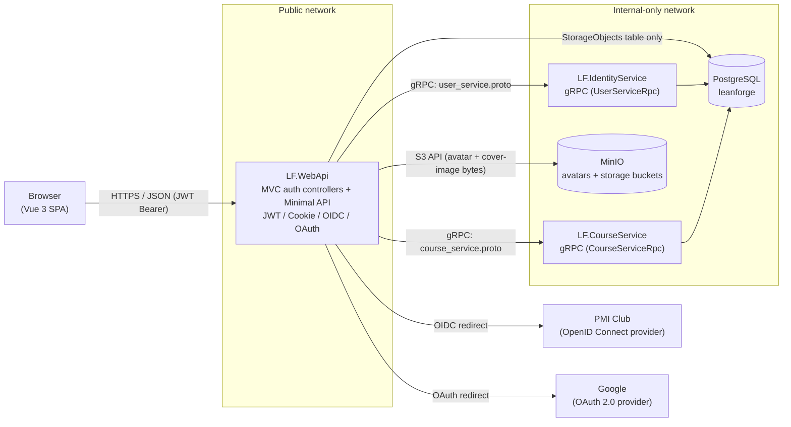
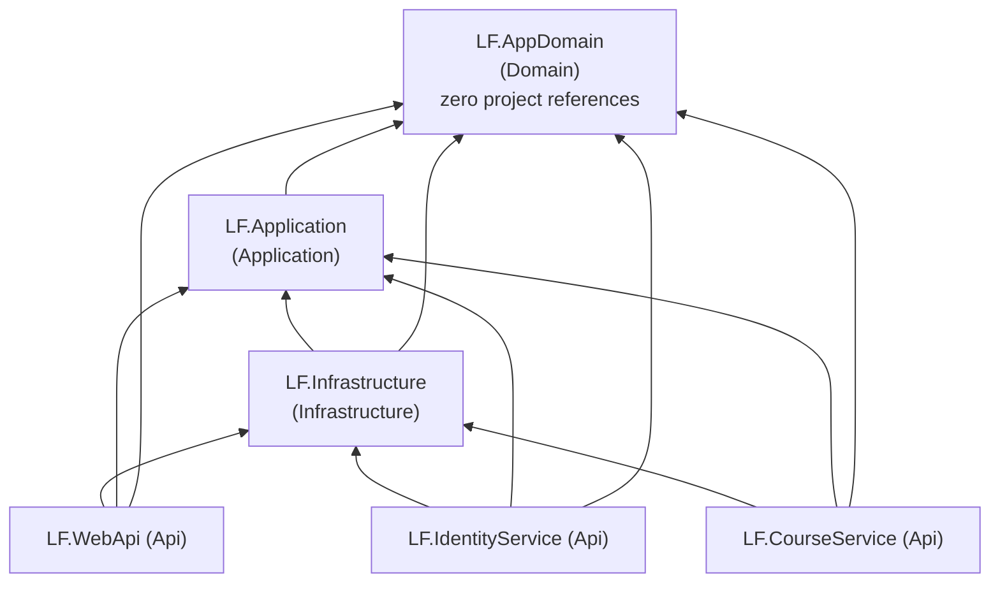

# Lean Forge LMS

[](https://github.com/TopTuK/LeanForgeLMS/actions/workflows/tests.yml)
[](https://github.com/TopTuK/LeanForgeLMS/actions/workflows/webapp-tests.yml)

Lean Forge LMS is a Learning Management System for an online school for developers. It's a solo-developer project built on **.NET 10** with a **Vue 3** SPA frontend, orchestrated locally with **.NET Aspire** and deployed to production as plain **Docker Compose** services.

The domain has moderate business rules (enrollment, progress tracking, course lifecycle) — not CRUD-only, but not a rich DDD domain either. The implemented slice covers authentication, user identity, profile/avatar management, and the full course domain: category-tagged courses with chapters/lessons made of ordered text/image/video/audio parts, cover art (predefined color or an uploaded image), publishing, a student catalog, ownership-restricted enrollment (a course's own creator can't enroll in it), and per-lesson progress tracking.

## Architecture

### Service topology

The system runs as **three independently deployable ASP.NET Core processes** plus the SPA, not a single monolith:

- **`LF.WebApi`** — the only public-facing process. Hosts the Vue SPA, the JWT/Cookie/OIDC authentication pipeline (MVC controllers), and the growing Minimal API surface (`IEndpointGroup`s). It never touches user or course data in Postgres directly — only `StorageObjects` (see below).
- **`LF.IdentityService`** — an internal gRPC-only service that owns the Postgres-backed `AppDbContext` and all user identity data. Not reachable from outside the deployment network.
- **`LF.CourseService`** — an internal gRPC-only service that owns the course domain: courses, categories, chapters, lessons, and enrollments. Shares the same Postgres database as `LF.IdentityService` (`leanforge`) but only ever touches its own tables. Not reachable from outside the deployment network.
- **MinIO** — S3-compatible object storage. Only `LF.WebApi` talks to it; it is never exposed to the browser. Two buckets: `avatars` (user avatars) and `storage` (course cover images, and lesson media — image/video/audio blocks).



Why the split exists: `LF.IdentityService` is the single owner of user identity data; `LF.CourseService` is the single owner of the course domain. `LF.WebApi` reaches both exclusively through their gRPC contracts (`user_service.proto`, `course_service.proto`) — it has no `AppDbContext` registration for *their* tables, even though it references `LF.Infrastructure`. Course/chapter/lesson/enrollment mutations always go through `LF.CourseService`'s gRPC contract, since they carry real business rules (ownership checks, publish invariants) that must not be duplicated across processes.

`StorageObjects` (avatar and cover-image metadata) is the one deliberate exception: it's a generic, ownerless table, and `LF.WebApi` is the only process with both a MinIO client and a use for writing to it, so it registers `AppDbContext` too — just for that one table — letting `IStorageService.UploadImageAsync` do the MinIO upload and the metadata write in a single call instead of a gRPC round-trip. `LF.CourseService` only ever *reads* `StorageObjects` (a plain FK join to resolve a course's cover image), never writes it.

### Clean Architecture layers

Within each service, code follows Clean Architecture with dependencies pointing strictly inward:



| Layer | Project | Responsibility |
|---|---|---|
| Domain | `LF.AppDomain` | Entities with behavior (`DbUser`, `Course`, `Chapter`, `Lesson`, `Category`, `Enrollment`, `StorageObject`), enums (`UserRole`, `CourseCoverType`, `CourseCoverColor`, `StorageObjectType`). Zero project or framework references by design. |
| Application | `LF.Application` | Use-case services (`UserService`, `ProfileService`, `AdminUserService`, `AuthenticationService`, `TokenService`, `CourseService`, `CourseAuthoringService`, `EnrollmentService`, `EnrollmentLearningService`, `StorageService`), DTOs, Mapster mapping configs, and the abstractions Infrastructure implements (`IAppDbContext`, `IFileStorageService`, `IGrpcIdentityService`, `IGrpcCourseService`, `IStorageRepository`). No mediator/dispatcher library — endpoints call these services directly. |
| Infrastructure | `LF.Infrastructure` | EF Core (`AppDbContext`, Npgsql), the gRPC clients to `LF.IdentityService` and `LF.CourseService`, the MinIO-backed `IFileStorageService` implementation (two keyed buckets), and `StorageRepository` — the one deliberate exception to "no repository per entity". Split into narrow DI extensions (`AddInfrastructureDatabase`, `AddInfrastructureGrpcClient`, `AddInfrastructureCourseGrpcClient`, `AddInfrastructureFileStorage`) so each host wires up only what it needs. |
| Api | `LF.WebApi`, `LF.IdentityService`, `LF.CourseService` | Host projects. `LF.WebApi` is ASP.NET Core MVC (existing auth) + Minimal API (`IEndpointGroup`, auto-discovered, new features) — the only public-facing, browser-reachable process. `LF.IdentityService` and `LF.CourseService` are bare gRPC hosts, internal-only. |

Two intentional deviations from "textbook" Clean Architecture, worth knowing about:

- **`AppDbContext` is registered in all three hosts, but each only touches the tables it owns.** `LF.IdentityService` owns `Users`; `LF.CourseService` owns `Courses`/`Categories`/`Chapters`/`Lessons`/`Enrollments`; `LF.WebApi` only ever reads/writes `StorageObjects` (see above) — it has no access path to the other tables beyond what the gRPC contracts expose. This is enforced by convention (which service's `Program.cs`/DI calls which use-case services), not by database-level permissions.
- **`LF.Application`'s DI is split by host, not one `AddApplication()`.** `AddAuthenticationApplication()` (auth/token/profile/admin/course-authoring/enrollment-learning/storage services) is called only by `LF.WebApi`; `AddUserApplication()` (`UserService`) only by `LF.IdentityService`; `AddCourseApplication()` (`CourseService`, `EnrollmentService`) only by `LF.CourseService`. ASP.NET Core validates the whole DI graph at `Build()`, so a single umbrella registration would crash whichever host doesn't have all the dependencies wired up.

### Authentication flow

The Login page offers two external identity providers — PMI Club and Google — both funneling into the same temp-cookie handshake and the same JWT-minting step, but wired up with different ASP.NET Core auth handlers:

- **PMI Club** uses a generic `AddOpenIdConnect` scheme (`LFPmiOidc`), because PMI is a custom OIDC provider with no dedicated ASP.NET Core package. The code exchange is done manually in an `OnAuthorizationCodeReceived` event handler (discovery document lookup + `Duende.IdentityModel.Client`), including manually forwarding the PKCE `code_verifier` the handler generated during the challenge — `AddOpenIdConnect` defaults `UsePkce = true`, and skipping this step is a real failure mode (`invalid_grant` from a provider that enforces PKCE, like Google would if it used this path).
- **Google** uses the dedicated `AddGoogle` handler (`Microsoft.AspNetCore.Authentication.Google`, scheme `LFGoogleOAuth`), which does its own PKCE + token exchange + userinfo lookup internally — no manual code exchange needed. Its default `ClaimActions` map to the long `ClaimTypes.*` claim URIs; `Program.cs` remaps `sub`/`email`/`name` to the same short claim types PMI's OIDC handler produces, so the callback parsing logic in `AuthController` doesn't need to special-case either provider.

1. Browser hits `GET /api/Auth/SignInPmi` or `GET /api/Auth/SignInGoogle` → `LF.WebApi` issues a `Challenge` against the corresponding provider, using a **temporary cookie sign-in scheme** to hold the handshake state.
2. The provider redirects back to `GET /api/Auth/SingInPmiCallback` or `GET /api/Auth/SignInGoogleCallback`. `AuthController` reads the temp-cookie principal, extracts `sub`/`email`/`name` claims, and calls `AuthenticationService.AuthenticatePmiUserAsync` or `AuthenticateGoogleUserAsync` — both are thin wrappers with identical shape, since the actual work is provider-agnostic.
3. That call goes over gRPC to `LF.IdentityService` (`GetOrCreateUser`), which looks up or creates the `DbUser` row (`Role = Student` by default for new users) — matched by the claims alone, with no separate "provider" field, so signing in with PMI and Google using the same email is treated as the same account.
4. `LF.WebApi` mints its **own JWT** (`TokenService.CreateWebJwtToken`) from the returned user, containing `NameIdentifier`, `email`, and `role` claims, and stores it in a **non-`HttpOnly` cookie** (`LfAuthCookie`) — deliberately readable by client-side JS.
5. The Vue SPA reads that cookie value directly (`js-cookie`) and attaches it as an `Authorization: Bearer` header on every `axios` call (see `lf.webapp/src/services/api.js`). This is why authenticated resources meant for ``/direct browser navigation (like the avatar or course-cover-image endpoints) have to be fetched as a blob via `axios` and turned into an object URL — a plain `` request carries no bearer header.

JWT Bearer is the default authenticate/challenge scheme for the rest of the API; the OIDC/OAuth and temp-cookie schemes exist solely to complete the external handshake. This wiring in `LF.WebApi/Program.cs` is deliberately fragile (specific cookie/OIDC/JWT interplay) and isn't changed casually.

### Development-only login shortcuts

`GET /api/dev-auth/{role}` (`role` = `Student`, `Instructor`, `CourseCreator`, or `Admin`) is a **local development and testing convenience** — it ensures a fixed test persona (email/first/last name configured under `DevAuth` in `appsettings.Development.json`) exists with the requested role, mints the same JWT cookie the real PMI login issues, and redirects to `/courses` — reproducing a real login without needing a working OIDC provider. There is no UI for it; it's meant to be hit directly (browser address bar, curl, or an automated/E2E test).

**This is excluded from production, not just hidden:**

- `DevAuthEndpoints.Map()` (`LF.WebApi/Endpoints/DevAuthEndpoints.cs`) checks `IHostEnvironment.IsDevelopment()` and simply never calls `MapGet` when it's `false` — the route doesn't exist in the endpoint routing table at all outside Development (confirmed empirically: building the app with `EnvironmentName = "Production"` registers zero routes under `/api/dev-auth`, vs. one in `"Development"`). It's a structural absence, not a guarded 404.
- `docker-compose.yml` (the production deployment) explicitly sets `ASPNETCORE_ENVIRONMENT: Production` for `lf-webapi`, `lf-identityservice`, and `lf-courseservice`. Even without that, ASP.NET Core's own default when `ASPNETCORE_ENVIRONMENT` is unset is `Production` — so a misconfigured deploy fails closed, not open.
- The `DevAuth` persona configuration itself only exists in `appsettings.Development.json`, never in `appsettings.json` (the file that ships in the production image) or `docker-compose.yml`.

### Course, category & enrollment domain

Owned entirely by `LF.CourseService`, exposed to `LF.WebApi` over `course_service.proto` (`CourseServiceRpc`):

- **`Course`** — title, short introduction, description, a `Category`, an ordered list of `Chapter`s (each with an ordered list of `Lesson`s), a `CoverType`/`CoverColor`/cover image, and an `IsPublished` flag. `Publish()` enforces the invariant that a course needs at least one chapter and every chapter needs at least one lesson.
- **`Lesson`** — a title plus, in addition to a legacy single `Content` HTML string (kept for backward compatibility), an ordered list of `LessonPart`s: text blocks (rich HTML) interleaved with image/video/audio blocks, each media block referencing a `StorageObject`. `Lesson.ReplaceParts(...)` is a full bulk-replace — the whole ordered set is swapped in one call, matching how the editor UI batches local edits before saving.
- **`Category`** — a flat, admin-managed tag set. Seeded with a protected `Common` category (`IsDefault = true`, cannot be deleted) plus a handful of starter categories (Backend, Frontend, DevOps, Design, Career). Categories still assigned to a course can't be deleted either.
- **`Enrollment`** — tracks a student's progress through a published course, one row per (student, course), with per-lesson completion state. A user cannot enroll in a course they created themselves — `EnrollmentService.EnrollAsync` rejects it (`SelfEnrollmentException`, mapped to `403 Forbidden`) and `BrowseCatalogAsync` excludes the acting user's own courses from their catalog results in the first place, so there's no enroll action to even attempt on them. This is an ownership check (`Course.CreatedByUserId`), not a role-based ban — an Instructor or CourseCreator can still enroll in someone else's published course.

Two distinct endpoint groups on `LF.WebApi` reflect the two audiences:

- **`/api/courses`** (`RequireAuthorization("CourseCreatorOrAdmin")`) — course authoring: create a course (with cover), list/get your own courses (or all of them, if admin), add/rename/reorder chapters and lessons, replace a lesson's parts, upload lesson/cover media and stream it back, publish. Backed by `CourseAuthoringService` → `IGrpcCourseService` → `RpcCourseService` → `CourseService` (real EF-backed implementation, inside `LF.CourseService`).
- **`/api/enrollments`** (`RequireAuthorization()`, any authenticated user) — the student side: browse the published-course catalog, enroll, list your own enrollments, view one enrollment's progress (including each lesson's parts, streamed via an ownership-checked media endpoint), mark a lesson complete. Backed by `EnrollmentLearningService` → `IGrpcEnrollmentService` → `RpcCourseService` → `EnrollmentService`.

Course authoring only supports setting fields at creation time today — there's no "edit course settings" endpoint yet; editing after creation is limited to chapters, lessons (including their parts), and publishing (`CourseEditorView.vue`, `LessonEditorView.vue`). Students view lesson parts on `CourseLearnView.vue`, which renders the parts list when present and falls back to the legacy `Content` string for lessons authored before this feature existed.

### Course covers, lesson media & the Storage service

Course creators pick a cover when creating a course — either a predefined solid color or an uploaded image — and can attach images/video/audio to individual lesson parts, both via the same generic storage abstraction:

- **`IStorageService`/`StorageService`** (`LF.Application/Services/Storage`, registered and running inside `LF.WebApi`) exposes `UploadMediaAsync(StorageObjectType, ...)`: it uploads the file to the `storage` MinIO bucket via `IFileStorageService`, then persists a `StorageObject` metadata row (key, content type, size, uploader, timestamp) via `IStorageRepository`, and returns both in one call. `UploadImageAsync` (used by the cover-image flow) is now a thin delegation to `UploadMediaAsync(StorageObjectType.Image, ...)` — object keys stay `images/{guid}{ext}` for images, with `videos/{guid}{ext}` and `audio/{guid}{ext}` for lesson video/audio.
- **`IStorageRepository`/`StorageRepository`** (`LF.Infrastructure/Persistence/Repositories`) is a thin EF wrapper around `IAppDbContext.StorageObjects` — the only repository class in the codebase (an explicit, deliberate exception; every other entity is accessed via `IAppDbContext`/`DbSet<T>` directly).
- **Cover flow**: `POST /api/courses/cover-image` uploads the file and returns a `storageObjectId`; `POST /api/courses` (create) references that id (for an image cover) or a `CourseCoverColor` enum value (for a color cover) — `CourseService.CreateCourseAsync` validates and attaches it via `Course.SetImageCover`/`SetColorCover`. `GET /api/courses/{id}/cover/image` streams the stored bytes back, the same blob-then-object-URL pattern as the avatar endpoint.
- **Lesson media flow**: `POST /api/courses/lesson-media` uploads a single file — the target `StorageObjectType` (Image/Video/Audio) is inferred from the file's content type, not passed separately — and returns a `storageObjectId`. The lesson editor uploads media eagerly as each file is picked, then `PUT .../lessons/{id}/parts` bulk-replaces the lesson's ordered part list, referencing already-uploaded media by id. `GET .../lessons/{id}/parts/{partId}/media` streams a part's media back — once from the course-authoring side (ownership-checked) and once from the enrollment side (`/api/enrollments/{enrollmentId}/lessons/{lessonId}/parts/{partId}/media`, enrollment-ownership-checked) — so a student never needs course-authoring permissions just to view a lesson they're enrolled in.
- Predefined colors (`CourseCoverColor`: Coral, Ocean, Forest, Amber, Slate, Berry) are backend-validated enum values, not free text — their hex values live as CSS custom properties (`--color-cover-*`) in `lf.webapp/src/main.css`, with separate light/dark-theme variants.

### Admin area

Users with `Role = Admin` get an "Administration" entry point in the SPA header (hidden from everyone else) leading to `/admin/users`, `/admin/categories`, and `/admin/courses`:

- **Users** (`/admin/users`) — a Vuestic UI data table for listing, searching, editing, role-assigning, and deleting other users.
- **Categories** (`/admin/categories`) — add or delete course categories; the default `Common` category can't be deleted, and neither can a category still assigned to a course.
- **Courses** (`/admin/courses`) — still a placeholder; there's no dedicated course-moderation UI yet even though the course domain itself is fully built.

- **Backend (users)**: `LF.WebApi/Endpoints/AdminUserEndpoints.cs` (`/api/admin/users`, `RequireAuthorization("AdminOnly")`) calls `IAdminUserService` (`LF.Application/Services/Admin/AdminUserService.cs`) directly, which wraps `IGrpcIdentityService` — the same direct-injection shape as `ProfileService`, no mediator/dispatcher layer in between.
- **Backend (categories)**: `LF.WebApi/Endpoints/AdminCategoryEndpoints.cs` (`/api/admin/categories`, `RequireAuthorization("AdminOnly")`) calls `ICourseAuthoringService`, which forwards over gRPC to `CourseService.CreateCategoryAsync`/`DeleteCategoryAsync` — the "can't delete the default or an in-use category" checks live server-side there, not just in the UI.
- **Authorization**: an `AdminOnly` policy (`Program.cs`), additive on top of the existing JWT/Cookie/OIDC wiring: `RequireClaim(ClaimTypes.Role, nameof(UserRole.Admin))`. It checks `ClaimTypes.Role`, not the literal `"role"` claim the JWT is issued with — `JwtBearerHandler`'s default inbound claim mapping silently renames `"role"` → `ClaimTypes.Role` when building the request's `ClaimsPrincipal`, so checking the literal string would 403 everyone, including admins.
- **Self-protection**: an admin can't change their own role or delete their own account — `AdminUserService` throws `SelfAdministrationException`, mapped to `409 Conflict`, checked server-side and mirrored client-side (disabled row actions) so it can't be worked around by calling the API directly.
- **Testing without a real PMI/Google login**: the dev-login shortcut (`GET /api/dev-auth/{role}`) also accepts `Admin`, alongside the original Student/Instructor/CourseCreator personas.

### File storage (avatars, course covers & lesson media)

- Two MinIO buckets, both provisioned by a small `IHostedService` (`MinioBucketInitializer`) on `LF.WebApi` startup: `avatars` (user avatars) and `storage` (course cover images and lesson media, keyed as a separate `IFileStorageService` instance via .NET keyed DI).
- Avatar upload (`POST /api/profile/avatar`) validates content-type (PNG/JPEG/WEBP) and size (≤5 MB), stores the file under a fresh `avatars/{userId}/{guid}{ext}` key, persists the key via `ProfileService.UpdateAvatarAsync` → gRPC → Postgres, and deletes the previous object. Download (`GET /api/profile/avatar`) streams the stored object, or falls back to a bundled default SVG (`LF.WebApi/wwwroot/images/default-avatar.svg`) when the user has no custom avatar.
- Course cover image upload (`POST /api/courses/cover-image`) follows the same size/content-type rules, stores the file under `images/{guid}{ext}` in the `storage` bucket, and returns a `StorageObject` id for the course-creation form to reference (see above).
- Lesson media upload (`POST /api/courses/lesson-media`) accepts PNG/JPEG/WEBP/GIF images (≤5 MB), MP4/WEBM video (≤200 MB), or MPEG/WAV/OGG/WEBM audio (≤50 MB) — the content type alone determines both the `StorageObjectType` and which limit applies. Files land under `videos/{guid}{ext}` / `audio/{guid}{ext}` / `images/{guid}{ext}` in the same `storage` bucket as cover images; the size limits are current defaults, not product-reviewed final numbers.
- MinIO is never reachable from the browser, in Aspire dev orchestration or in `docker-compose.yml` — the same internal-only-network posture as Postgres.

## Project structure

```
LeanForgeLMS.slnx
LeanForgeLMS.AppHost/            # .NET Aspire orchestration: postgres, minio, lf-webapp (Vite), lf-identityservice, lf-courseservice, lf-webapi
LeanForgeLMS.ServiceDefaults/    # Shared Aspire defaults: OpenTelemetry, health checks, service discovery, HTTP resilience, Serilog console logging
LF.AppDomain/                    # Domain layer — Entities/{User,Course,Storage}, Models/{User,Course,Storage}/Enums
LF.AppDomainTests/               # xUnit v3 unit tests for LF.AppDomain entities
LF.Application/                  # Application layer — Services/{Authentication,Profile,User,Admin,Course,CourseAuthoring,Enrollment,EnrollmentLearning,Storage}, ModelDto/*, Common/Interfaces, Common/Mapping
LF.ApplicationTests/             # xUnit v3 unit tests for LF.Application (Moq + MockQueryable.Moq)
LF.Infrastructure/                # Infrastructure layer — Persistence/AppDbContext.cs + Repositories/, Services/Identity + Course (gRPC clients), Services/Storage (MinIO)
LF.WebApi/                       # Public host — MVC auth controllers, Endpoints/ (Minimal API), Program.cs auth pipeline
LF.IdentityService/              # Internal gRPC host — Services/RpcUserService.cs, Protos/user_service.proto
LF.CourseService/                # Internal gRPC host — Services/RpcCourseService.cs, Protos/course_service.proto
lf.webapp/                       # Vue 3 + Vite SPA
docker-compose.yml               # Production deployment (postgres, minio, lf-identityservice, lf-courseservice, lf-webapi)
```

## Tech stack

| Concern | Choice |
|---|---|
| Runtime | .NET 10 / C# 14 |
| Web framework | ASP.NET Core — MVC (existing auth) + Minimal APIs (`IEndpointGroup`, new features) |
| Local orchestration | .NET Aspire (AppHost + ServiceDefaults) |
| Inter-service RPC | gRPC (`Grpc.AspNetCore` / `Grpc.Net.Client`), contracts in `LF.IdentityService/Protos/user_service.proto` and `LF.CourseService/Protos/course_service.proto` |
| Database | PostgreSQL via `Npgsql.EntityFrameworkCore.PostgreSQL`, one shared `leanforge` database — `LF.IdentityService` owns `Users`, `LF.CourseService` owns the course domain, `LF.WebApi` owns `StorageObjects` |
| Object storage | MinIO (`CommunityToolkit.Aspire.Hosting.Minio` + `.Minio.Client`), owned solely by `LF.WebApi` — `avatars` and `storage` buckets |
| Authentication | JWT Bearer (primary scheme) + Cookie + OpenID Connect (Duende.IdentityModel) against PMI Club + OAuth 2.0 (`Microsoft.AspNetCore.Authentication.Google`) against Google |
| Object mapping | Mapster |
| Validation | FluentValidation (referenced in `LF.WebApi` today) |
| Logging | Serilog (`Serilog.AspNetCore`), centralized in `LeanForgeLMS.ServiceDefaults` and applied to all three backend hosts — colorized console output, two-stage bootstrap (captures startup errors before DI is up), one summary line per request/RPC |
| Observability | OpenTelemetry (traces + metrics) via `LeanForgeLMS.ServiceDefaults`, OTLP export when `OTEL_EXPORTER_OTLP_ENDPOINT` is set |
| Testing | Backend: xUnit v3 + Moq + MockQueryable.Moq (unit tests only today — Testcontainers/WebApplicationFactory integration testing is planned, not yet built). Frontend: Vitest + `@testing-library/vue` component tests (`lf.webapp`) |
| Frontend | Vue 3 (Composition API) + Vite, Pinia, vue-router, vue-i18n (en/ru), Vuestic UI, Tailwind CSS v4, axios |
| Containerization | Multi-stage Dockerfiles (Node build → .NET SDK build → ASP.NET runtime), Docker Compose for production |

**Not yet decided / explicitly deferred:** caching (no HybridCache/Redis), inter-service messaging (no Wolverine/MassTransit — gRPC direct calls only), editing course settings after creation, course covers on the student-facing catalog/active/finished views (creators see their own covers today; the browse/enrolled views don't render them yet), and the lesson video/audio upload size limits (200 MB / 50 MB) — current placeholders, not yet verified against Kestrel/dev-proxy request-body-size limits or signed off as final by anyone but the implementer.

## Getting started

### Prerequisites

- .NET 10 SDK
- Node.js 22.18+ (or 24.12+)
- Docker (for the Aspire-managed Postgres/MinIO containers, or for `docker-compose.yml`)

### Run everything via Aspire (recommended)

```bash
dotnet run --project LeanForgeLMS.AppHost
```

This starts Postgres, MinIO, the Vite dev server, `LF.IdentityService`, `LF.CourseService`, and `LF.WebApi`, wires connection strings/service discovery between them automatically, and opens the Aspire dashboard (OpenTelemetry traces/metrics/logs for every resource).

> **Known issue:** `LF.IdentityService` and `LF.CourseService` both set `Kestrel:EndpointDefaults:Protocols` to `Http2` (standard gRPC-service scaffolding), which also makes their `/health` endpoints HTTP/2-only. The AppHost's `WaitFor(...)` health probes use HTTP/1.1 and get rejected, so `lf-webapi` can hang indefinitely waiting to start. If that happens, run the services standalone instead (below). Root-fixing the AppHost health check hasn't been attempted.

### Run services standalone (without Aspire)

```bash
# Identity service — needs its own Postgres connection string configured
dotnet run --project LF.IdentityService --no-launch-profile     # http://localhost:5296

# Course service — needs its own Postgres connection string configured (same "leanforge" database)
dotnet run --project LF.CourseService --no-launch-profile

# Web API — needs LF.IdentityService, LF.CourseService, MinIO, and Postgres reachable,
# PmiAuth/GoogleAuth/DefaultAuth config set, and DOTNET_SYSTEM_NET_HTTP_SOCKETSHTTPHANDLER_HTTP2UNENCRYPTEDSUPPORT=1
# so its gRPC clients can reach the h2c-only Kestrel endpoints above.
dotnet run --project LF.WebApi --no-launch-profile              # http://localhost:5207

# Frontend dev server, proxied by LF.WebApi in Development
cd lf.webapp && npm run dev                                     # http://localhost:5173
```

### Build & test

```bash
dotnet build LeanForgeLMS.slnx
dotnet test
cd lf.webapp && npm run lint && npm test
```

Frontend tests use Vitest (`npm test`, or `npm run test:watch` / `npm run test:coverage`); component specs live beside their components as `*.spec.js`. CI runs the backend suites (`tests.yml`) and the webapp lint/test/build (`webapp-tests.yml`) on every PR to `main`.

### Database migrations

`AppDbContext` is registered in all three backend hosts (see [Clean Architecture layers](#clean-architecture-layers)), but `LF.IdentityService` is the recommended startup project for EF tooling — it has the simplest dependency graph (no gRPC client wiring needed at build time):

```bash
dotnet ef migrations add <Name> \
  --project LF.Infrastructure \
  --startup-project LF.IdentityService \
  --context AppDbContext
```

## Production deployment (Docker Compose)

`docker-compose.yml` defines five services across two Docker networks:

| Service | Network(s) | Host-exposed? |
|---|---|---|
| `postgres` | `leanforge-internal` | No |
| `minio` | `leanforge-internal` | No — avatar/cover-image bytes are always proxied through `lf-webapi` |
| `lf-identityservice` | `leanforge-internal` | No — gRPC only, reached by `lf-webapi` |
| `lf-courseservice` | `leanforge-internal` | No — gRPC only, reached by `lf-webapi` |
| `lf-webapi` | `leanforge-public` + `leanforge-internal` | Yes (`${WEBAPI_HOST_PORT:-8081}` → `8080`) |

`lf-webapi` is the only container with a published port and the only one on the public network (it needs outbound internet access for the PMI OIDC and Google OAuth handshakes). Everything else is internal-only and unreachable from the host or the internet. `lf-webapi` also gets its own `ConnectionStrings__leanforge`, needed for the `StorageObjects`-only database access described above.

```bash
cp .env.example .env   # fill in POSTGRES_PASSWORD, MINIO_ROOT_USER/PASSWORD, DefaultAuth__JwtKey, PmiAuth__*, GoogleAuth__*
docker compose up --build
```

## Coding conventions

Architecture rules, anti-patterns, and detailed conventions for contributing (Clean Architecture layering, Minimal API endpoint groups, gRPC contract-change discipline, auth-wiring cautions, etc.) live in [`CLAUDE.md`](./CLAUDE.md).
